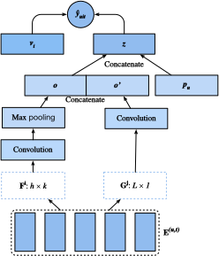

# シーケンスを考慮した推薦システム

前の節では、ユーザの短期的な行動を考慮せずに、推薦タスクを行列補完問題として抽象化した。この節では、時系列順に並んだユーザのインタラクションログを考慮する推薦モデルを紹介する。これはシーケンスを考慮した推薦モデル :cite:`Quadrana.Cremonesi.Jannach.2018` であり、入力は順序付きで、しばしばタイムスタンプ付きの過去のユーザ行動のリストである。近年の多くの研究では、このような情報を組み込むことが、ユーザの時間的な行動パターンをモデル化し、興味の変化を発見するうえで有用であることが示されている。

ここで紹介するモデル Caser :cite:`Tang.Wang.2018` は convolutional sequence embedding recommendation model の略で、畳み込みニューラルネットワークを用いて、ユーザの最近の活動がもたらす動的なパターンの影響を捉える。Caser の主要部分は水平畳み込みネットワークと垂直畳み込みネットワークからなり、それぞれ union-level と point-level のシーケンスパターンを抽出することを目的としている。point-level パターンは履歴シーケンス中の単一アイテムが対象アイテムに与える影響を示し、union-level パターンは複数の過去の行動が後続の対象に与える影響を意味する。たとえば、牛乳とバターを一緒に買うと、そのどちらか一方だけを買う場合よりも、小麦粉を買う確率が高くなる。さらに、ユーザの一般的な興味、すなわち長期的な嗜好も最後の全結合層でモデル化され、より包括的なユーザ興味のモデリングが実現される。モデルの詳細は以下のとおりである。

## モデルアーキテクチャ

シーケンスを考慮した推薦システムでは、各ユーザはアイテム集合からのいくつかのアイテムのシーケンスに対応付けられる。$S^u = (S_1^u, ... S_{|S_u|}^u)$ を順序付きシーケンスとする。Caser の目的は、ユーザの一般的な嗜好と短期的な意図の両方を考慮してアイテムを推薦することである。直前の $L$ 個のアイテムを考慮すると、時刻 $t$ におけるそれ以前のインタラクションを表す埋め込み行列は次のように構成できる。

$$
\mathbf{E}^{(u, t)} = [ \mathbf{q}_{S_{t-L}^u} , ..., \mathbf{q}_{S_{t-2}^u}, \mathbf{q}_{S_{t-1}^u} ]^\top,
$$

ここで $\mathbf{Q} \in \mathbb{R}^{n \times k}$ はアイテム埋め込みを表し、$\mathbf{q}_i$ はその $i^\textrm{th}$ 行を表す。$\mathbf{E}^{(u, t)} \in \mathbb{R}^{L \times k}$ は、時刻ステップ $t$ におけるユーザ $u$ の一時的な興味を推定するために用いることができる。入力行列 $\mathbf{E}^{(u, t)}$ は画像のように見なすことができ、後続の 2 つの畳み込みコンポーネントへの入力となる。

水平畳み込み層は $d$ 個の水平フィルタ $\mathbf{F}^j \in \mathbb{R}^{h \times k}, 1 \leq j \leq d, h = \{1, ..., L\}$ を持ち、垂直畳み込み層は $d'$ 個の垂直フィルタ $\mathbf{G}^j \in \mathbb{R}^{ L \times 1}, 1 \leq j \leq d'$ を持つ。一連の畳み込みとプーリング操作の後、次の 2 つの出力が得られる。

$$
\mathbf{o} = \textrm{HConv}(\mathbf{E}^{(u, t)}, \mathbf{F}) \\
\mathbf{o}'= \textrm{VConv}(\mathbf{E}^{(u, t)}, \mathbf{G}) ,
$$

ここで $\mathbf{o} \in \mathbb{R}^d$ は水平畳み込みネットワークの出力であり、$\mathbf{o}' \in \mathbb{R}^{kd'}$ は垂直畳み込みネットワークの出力である。簡単のため、畳み込みとプーリングの詳細は省略する。これらを連結し、より高次の表現を得るために全結合ニューラルネットワーク層へ入力する。

$$
\mathbf{z} = \phi(\mathbf{W}[\mathbf{o}, \mathbf{o}']^\top + \mathbf{b}),
$$

ここで $\mathbf{W} \in \mathbb{R}^{k \times (d + kd')}$ は重み行列、$\mathbf{b} \in \mathbb{R}^k$ はバイアスである。学習されたベクトル $\mathbf{z} \in \mathbb{R}^k$ は、ユーザの短期的な意図を表現したものである。

最後に、予測関数はユーザの短期的な嗜好と一般的な嗜好を組み合わせ、次のように定義される。

$$
\hat{y}_{uit} = \mathbf{v}_i \cdot [\mathbf{z}, \mathbf{p}_u]^\top + \mathbf{b}'_i,
$$

ここで $\mathbf{V} \in \mathbb{R}^{n \times 2k}$ は別のアイテム埋め込み行列である。$\mathbf{b}' \in \mathbb{R}^n$ はアイテム固有のバイアスである。$\mathbf{P} \in \mathbb{R}^{m \times k}$ は、ユーザの一般的な嗜好のためのユーザ埋め込み行列である。$\mathbf{p}_u \in \mathbb{R}^{ k}$ は $P$ の $u^\textrm{th}$ 行であり、$\mathbf{v}_i \in \mathbb{R}^{2k}$ は $\mathbf{V}$ の $i^\textrm{th}$ 行である。

このモデルは BPR 損失または Hinge 損失で学習できる。Caser のアーキテクチャを以下に示す。



まず、必要なライブラリをインポートする。

```{.python .input  n=3}
#@tab mxnet
from d2l import mxnet as d2l
from mxnet import gluon, np, npx
from mxnet.gluon import nn
import mxnet as mx
import random

npx.set_np()
```

## モデルの実装
以下のコードは Caser モデルを実装したものである。これは垂直畳み込み層、水平畳み込み層、および全結合層から構成される。

```{.python .input  n=4}
#@tab mxnet
class Caser(nn.Block):
    def __init__(self, num_factors, num_users, num_items, L=5, d=16,
                 d_prime=4, drop_ratio=0.05, **kwargs):
        super(Caser, self).__init__(**kwargs)
        self.P = nn.Embedding(num_users, num_factors)
        self.Q = nn.Embedding(num_items, num_factors)
        self.d_prime, self.d = d_prime, d
        # Vertical convolution layer
        self.conv_v = nn.Conv2D(d_prime, (L, 1), in_channels=1)
        # Horizontal convolution layer
        h = [i + 1 for i in range(L)]
        self.conv_h, self.max_pool = nn.Sequential(), nn.Sequential()
        for i in h:
            self.conv_h.add(nn.Conv2D(d, (i, num_factors), in_channels=1))
            self.max_pool.add(nn.MaxPool1D(L - i + 1))
        # Fully connected layer
        self.fc1_dim_v, self.fc1_dim_h = d_prime * num_factors, d * len(h)
        self.fc = nn.Dense(in_units=d_prime * num_factors + d * L,
                           activation='relu', units=num_factors)
        self.Q_prime = nn.Embedding(num_items, num_factors * 2)
        self.b = nn.Embedding(num_items, 1)
        self.dropout = nn.Dropout(drop_ratio)

    def forward(self, user_id, seq, item_id):
        item_embs = np.expand_dims(self.Q(seq), 1)
        user_emb = self.P(user_id)
        out, out_h, out_v, out_hs = None, None, None, []
        if self.d_prime:
            out_v = self.conv_v(item_embs)
            out_v = out_v.reshape(out_v.shape[0], self.fc1_dim_v)
        if self.d:
            for conv, maxp in zip(self.conv_h, self.max_pool):
                conv_out = np.squeeze(npx.relu(conv(item_embs)), axis=3)
                t = maxp(conv_out)
                pool_out = np.squeeze(t, axis=2)
                out_hs.append(pool_out)
            out_h = np.concatenate(out_hs, axis=1)
        out = np.concatenate([out_v, out_h], axis=1)
        z = self.fc(self.dropout(out))
        x = np.concatenate([z, user_emb], axis=1)
        q_prime_i = np.squeeze(self.Q_prime(item_id))
        b = np.squeeze(self.b(item_id))
        res = (x * q_prime_i).sum(1) + b
        return res
```

## 負例サンプリング付きのシーケンシャルデータセット
シーケンシャルなインタラクションデータを処理するには、`Dataset` クラスを再実装する必要がある。以下のコードは `SeqDataset` という新しいデータセットクラスを作成する。各サンプルでは、ユーザ ID、過去にインタラクションした $L$ 個のアイテムをシーケンスとして、そして次にインタラクションするアイテムをターゲットとして出力する。次の図は、1 人のユーザに対するデータ読み込みの流れを示している。このユーザが 9 本の映画を気に入ったとする。これら 9 本の映画を時系列順に並べる。最新の映画はテスト用アイテムとして除外される。残りの 8 本の映画については、3 つの訓練サンプルを得ることができ、各サンプルは 5 個の映画からなるシーケンス（$L=5$）と、その後続のアイテムをターゲットアイテムとして含む。カスタマイズしたデータセットには負例サンプルも含まれる。


```{.python .input  n=5}
#@tab mxnet
class SeqDataset(gluon.data.Dataset):
    def __init__(self, user_ids, item_ids, L, num_users, num_items,
                 candidates):
        user_ids, item_ids = np.array(user_ids), np.array(item_ids)
        sort_idx = np.array(sorted(range(len(user_ids)),
                                   key=lambda k: user_ids[k]))
        u_ids, i_ids = user_ids[sort_idx], item_ids[sort_idx]
        temp, u_ids, self.cand = {}, u_ids.asnumpy(), candidates
        self.all_items = set([i for i in range(num_items)])
        [temp.setdefault(u_ids[i], []).append(i) for i, _ in enumerate(u_ids)]
        temp = sorted(temp.items(), key=lambda x: x[0])
        u_ids = np.array([i[0] for i in temp])
        idx = np.array([i[1][0] for i in temp])
        self.ns = ns = int(sum([c - L if c >= L + 1 else 1 for c
                                in np.array([len(i[1]) for i in temp])]))
        self.seq_items = np.zeros((ns, L))
        self.seq_users = np.zeros(ns, dtype='int32')
        self.seq_tgt = np.zeros((ns, 1))
        self.test_seq = np.zeros((num_users, L))
        test_users, _uid = np.empty(num_users), None
        for i, (uid, i_seq) in enumerate(self._seq(u_ids, i_ids, idx, L + 1)):
            if uid != _uid:
                self.test_seq[uid][:] = i_seq[-L:]
                test_users[uid], _uid = uid, uid
            self.seq_tgt[i][:] = i_seq[-1:]
            self.seq_items[i][:], self.seq_users[i] = i_seq[:L], uid

    def _win(self, tensor, window_size, step_size=1):
        if len(tensor) - window_size >= 0:
            for i in range(len(tensor), 0, - step_size):
                if i - window_size >= 0:
                    yield tensor[i - window_size:i]
                else:
                    break
        else:
            yield tensor

    def _seq(self, u_ids, i_ids, idx, max_len):
        for i in range(len(idx)):
            stop_idx = None if i >= len(idx) - 1 else int(idx[i + 1])
            for s in self._win(i_ids[int(idx[i]):stop_idx], max_len):
                yield (int(u_ids[i]), s)

    def __len__(self):
        return self.ns

    def __getitem__(self, idx):
        neg = list(self.all_items - set(self.cand[int(self.seq_users[idx])]))
        i = random.randint(0, len(neg) - 1)
        return (self.seq_users[idx], self.seq_items[idx], self.seq_tgt[idx],
                neg[i])
```

## MovieLens 100K データセットの読み込み

その後、MovieLens 100K データセットをシーケンスを考慮したモードで読み込み・分割し、上で実装したシーケンシャルデータローダーを用いて訓練データを読み込みる。

```{.python .input  n=6}
#@tab mxnet
TARGET_NUM, L, batch_size = 1, 5, 4096
df, num_users, num_items = d2l.read_data_ml100k()
train_data, test_data = d2l.split_data_ml100k(df, num_users, num_items,
                                              'seq-aware')
users_train, items_train, ratings_train, candidates = d2l.load_data_ml100k(
    train_data, num_users, num_items, feedback="implicit")
users_test, items_test, ratings_test, test_iter = d2l.load_data_ml100k(
    test_data, num_users, num_items, feedback="implicit")
train_seq_data = SeqDataset(users_train, items_train, L, num_users,
                            num_items, candidates)
train_iter = gluon.data.DataLoader(train_seq_data, batch_size, True,
                                   last_batch="rollover",
                                   num_workers=d2l.get_dataloader_workers())
test_seq_iter = train_seq_data.test_seq
train_seq_data[0]
```

上に示したのが訓練データの構造である。最初の要素はユーザ ID、次のリストはこのユーザが気に入った直近 5 個のアイテムを示し、最後の要素はその 5 個の後にこのユーザが気に入ったアイテムである。

## モデルの訓練
それでは、モデルを訓練しよう。比較可能な結果を得るために、前節の NeuMF と同じ設定、すなわち学習率、オプティマイザ、そして $k$ を用いる。

```{.python .input  n=7}
#@tab mxnet
devices = d2l.try_all_gpus()
net = Caser(10, num_users, num_items, L)
net.initialize(ctx=devices, force_reinit=True, init=mx.init.Normal(0.01))
lr, num_epochs, wd, optimizer = 0.04, 8, 1e-5, 'adam'
loss = d2l.BPRLoss()
trainer = gluon.Trainer(net.collect_params(), optimizer,
                        {"learning_rate": lr, 'wd': wd})

# Running takes > 1h (pending fix from MXNet)
# d2l.train_ranking(net, train_iter, test_iter, loss, trainer, test_seq_iter, num_users, num_items, num_epochs, devices, d2l.evaluate_ranking, candidates, eval_step=1)
```

## まとめ
* ユーザの短期的および長期的な興味を推定することで、ユーザが好みそうな次のアイテムをより効果的に予測できる。
* 畳み込みニューラルネットワークは、シーケンシャルなインタラクションからユーザの短期的な興味を捉えるために利用できる。

## 演習

* 水平畳み込みネットワークと垂直畳み込みネットワークの一方を取り除くアブレーション研究を行っよ。どちらのコンポーネントがより重要だろうか？
* ハイパーパラメータ $L$ を変えてみよ。より長い履歴のインタラクションは、より高い精度をもたらすだろうか？
* 上で紹介したシーケンスを考慮した推薦タスクのほかに、session-based recommendation と呼ばれる別の種類のシーケンスを考慮した推薦タスクがある :cite:`Hidasi.Karatzoglou.Baltrunas.ea.2015`。この 2 つのタスクの違いを説明できるか？
