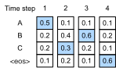

# ビームサーチ
:label:`sec_beam-search`

:numref:`sec_seq2seq` では、エンコーダ--デコーダアーキテクチャと、それらをエンドツーエンドで学習するための標準的な手法を導入した。しかし、テスト時の予測については、各時刻で次に来ると予測される確率が最も高いトークンを選び、ある時刻で特別な文末トークン "&lt;eos&gt;" を予測するまで続ける *greedy* 戦略だけを述べた。  
この節では、まずこの *greedy search* 戦略を形式化し、実務者がしばしば直面する問題を明らかにする。その後、この戦略を2つの代替手法、すなわち *exhaustive search*（説明には有用だが実用的ではない）と *beam search*（実務で標準的な手法）と比較する。

まず、 :numref:`sec_seq2seq` の慣例を借りて、数学的記法を整えよう。任意の時刻 $t'$ において、デコーダは、語彙中の各トークンが次に系列に現れる確率（すなわち $y_{t'+1}$ のもっともらしい値）を表す予測を出力する。これは、直前のトークン $y_1, \ldots, y_{t'}$ と、入力系列を表現するためにエンコーダが生成した文脈変数 $\mathbf{c}$ に条件づけられている。計算コストを定量化するために、出力語彙（特別な文末トークン "&lt;eos&gt;" を含む）を $\mathcal{Y}$ と表す。また、出力系列の最大トークン数を $T'$ とする。私たちの目標は、$\mathcal{O}(\left|\mathcal{Y}\right|^{T'})$ 個の可能な出力系列の中から、理想的な出力を探索することである。なお、"&lt;eos&gt;" トークンが現れた後はそれ以降のトークンは存在しないため、この数は異なる出力数をやや過大評価している。しかし、ここではこの数が探索空間の大きさをおおよそ捕えていると考えてよい。

## Greedy Search

:numref:`sec_seq2seq` の単純な *greedy search* 戦略を考える。ここでは、任意の時刻 $t'$ において、$\mathcal{Y}$ の中から条件付き確率が最も高いトークンを単純に選ぶ。すなわち、

$$y_{t'} = \operatorname*{argmax}_{y \in \mathcal{Y}} P(y \mid y_1, \ldots, y_{t'-1}, \mathbf{c}).$$

モデルが "&lt;eos&gt;" を出力した時点で（あるいは最大長 $T'$ に達した時点で）、出力系列は完了する。

この戦略はもっともらしく見えるし、実際それほど悪くはない。計算負荷が非常に小さいことを考えると、費用対効果はかなり高いと言える。  
しかし、効率のことを少し脇に置くと、より合理的なのは、（貪欲に選ばれた）*最も確率の高いトークン列* ではなく、*最も確率の高い系列* を探索することだと思えるかもしれない。ところが、この2つはかなり異なる場合がある。最も確率の高い系列とは、式
$\prod_{t'=1}^{T'} P(y_{t'} \mid y_1, \ldots, y_{t'-1}, \mathbf{c})$
を最大化する系列である。機械翻訳の例では、デコーダが本当に基礎となる生成過程の確率を復元しているなら、これが最も確からしい翻訳を与えるはずである。残念ながら、greedy search がこの系列を与える保証はない。

例で見てみよう。出力辞書に "A"、"B"、"C"、"&lt;eos&gt;" の4つのトークンがあるとする。 :numref:`fig_s2s-prob1` では、各時刻の下にある4つの数は、その時刻に "A"、"B"、"C"、"&lt;eos&gt;" を生成する条件付き確率をそれぞれ表している。

:label:`fig_s2s-prob1`

各時刻で、greedy search は条件付き確率が最も高いトークンを選ぶ。したがって、出力系列 "A"、"B"、"C"、"&lt;eos&gt;" が予測される（:numref:`fig_s2s-prob1`）。この出力系列の条件付き確率は $0.5\times0.4\times0.4\times0.6 = 0.048$ である。

次に、 :numref:`fig_s2s-prob2` の別の例を見てみよう。 :numref:`fig_s2s-prob1` とは異なり、時刻2では、条件付き確率が *2番目に高い* トークン "C" を選ぶ。

:label:`fig_s2s-prob2`

時刻3は時刻1と2の出力部分系列に基づくため、その部分系列が :numref:`fig_s2s-prob1` の "A" と "B" から、 :numref:`fig_s2s-prob2` の "A" と "C" に変わると、 :numref:`fig_s2s-prob2` における時刻3の各トークンの条件付き確率も変化する。時刻3でトークン "B" を選ぶとしよう。すると時刻4は、最初の3時刻の出力部分系列 "A"、"C"、"B" に条件づけられるが、これは :numref:`fig_s2s-prob1` の "A"、"B"、"C" とは異なる。したがって、 :numref:`fig_s2s-prob2` における時刻4で各トークンを生成する条件付き確率も :numref:`fig_s2s-prob1` とは異なる。その結果、 :numref:`fig_s2s-prob2` における出力系列 "A"、"C"、"B"、"&lt;eos&gt;" の条件付き確率は $0.5\times0.3 \times0.6\times0.6=0.054$ となり、 :numref:`fig_s2s-prob1` の greedy search よりも大きくなる。この例では、greedy search によって得られる出力系列 "A"、"B"、"C"、"&lt;eos&gt;" は最適ではない。

## Exhaustive Search

最も確からしい系列を得ることが目的なら、*exhaustive search* を使うことを考えられる。つまり、あり得るすべての出力系列とその条件付き確率を列挙し、その中で予測確率が最も高いものを出力する。

これなら確かに望む結果が得られるが、計算コストは $\mathcal{O}(\left|\mathcal{Y}\right|^{T'})$ と非常に高く、系列長に対して指数的であり、しかも語彙サイズという巨大な底を持つ。たとえば、$|\mathcal{Y}|=10000$、$T'=10$ のとき、どちらも実用上は小さい数であるが、$10000^{10} = 10^{40}$ 個の系列を評価する必要があり、これは将来見込まれるどんな計算機の能力をも超えている。一方、greedy search の計算コストは $\mathcal{O}(\left|\mathcal{Y}\right|T')$ である。驚くほど安価であるが、最適とはほど遠いものである。たとえば、$|\mathcal{Y}|=10000$、$T'=10$ のとき、評価すべき系列は $10000\times10=10^5$ 個で済む。

## Beam Search

系列デコードの戦略は連続的なスペクトル上にあると考えられる。その中で *beam search* は、greedy search の効率と exhaustive search の最適性の間の妥協点を提供する。最も基本的な beam search は、1つのハイパーパラメータ、すなわち *beam size* $k$ によって特徴づけられる。この用語を説明しよう。時刻1では、予測確率が最も高い $k$ 個のトークンを選ぶ。それぞれが、$k$ 個の候補出力系列の最初のトークンになる。以降の各時刻では、前の時刻の $k$ 個の候補出力系列に基づいて、$k\left|\mathcal{Y}\right|$ 通りの候補から、予測確率が最も高い $k$ 個の候補出力系列を選び続ける。

:label:`fig_beam-search`

:numref:`fig_beam-search` は、例を用いて beam search の過程を示している。出力語彙が5要素、すなわち $\mathcal{Y} = \{A, B, C, D, E\}$ で、そのうち1つが "&lt;eos&gt;" だとする。beam size を2、出力系列の最大長を3とする。時刻1では、条件付き確率 $P(y_1 \mid \mathbf{c})$ が最も高いトークンが $A$ と $C$ だとしよう。時刻2では、すべての $y_2 \in \mathcal{Y}$ について、

$$\begin{aligned}P(A, y_2 \mid \mathbf{c}) = P(A \mid \mathbf{c})P(y_2 \mid A, \mathbf{c}),\\ P(C, y_2 \mid \mathbf{c}) = P(C \mid \mathbf{c})P(y_2 \mid C, \mathbf{c}),\end{aligned}$$

を計算し、これら10個の値の中から最大の2つ、たとえば $P(A, B \mid \mathbf{c})$ と $P(C, E \mid \mathbf{c})$ を選ぶ。すると時刻3では、すべての $y_3 \in \mathcal{Y}$ について、

$$\begin{aligned}P(A, B, y_3 \mid \mathbf{c}) = P(A, B \mid \mathbf{c})P(y_3 \mid A, B, \mathbf{c}),\\P(C, E, y_3 \mid \mathbf{c}) = P(C, E \mid \mathbf{c})P(y_3 \mid C, E, \mathbf{c}),\end{aligned}$$

を計算し、これら10個の値の中から最大の2つ、たとえば $P(A, B, D \mid \mathbf{c})$ と $P(C, E, D \mid \mathbf{c})$ を選ぶ。その結果、6つの候補出力系列が得られる。すなわち、(i) $A$; (ii) $C$; (iii) $A$, $B$; (iv) $C$, $E$; (v) $A$, $B$, $D$; (vi) $C$, $E$, $D$ である。

最後に、これら6つの系列に基づいて最終的な候補出力系列の集合を得る（たとえば、"&lt;eos&gt;" を含む部分とその後を破棄する）。そして、次のスコアを最大化する出力系列を選ぶ。

$$ \frac{1}{L^\alpha} \log P(y_1, \ldots, y_{L}\mid \mathbf{c}) = \frac{1}{L^\alpha} \sum_{t'=1}^L \log P(y_{t'} \mid y_1, \ldots, y_{t'-1}, \mathbf{c});$$
:eqlabel:`eq_beam-search-score`

ここで $L$ は最終的な候補系列の長さであり、$\alpha$ は通常 0.75 に設定される。:eqref:`eq_beam-search-score` の和には、長い系列ほど対数項が多く含まれるため、分母の $L^\alpha$ は長い系列にペナルティを与える。

beam search の計算コストは $\mathcal{O}(k\left|\mathcal{Y}\right|T')$ である。この結果は、greedy search と exhaustive search の中間に位置する。greedy search は、beam size を1に設定したときに現れる beam search の特殊な場合とみなせる。

## まとめ

系列探索の戦略には、greedy search、exhaustive search、beam search がある。beam search は、beam size を柔軟に選ぶことで、精度と計算コストのトレードオフを提供する。

## 演習

1. exhaustive search を beam search の特殊な種類として扱うことはできるか。なぜか、あるいはなぜできないか。
1. :numref:`sec_seq2seq` の機械翻訳問題に beam search を適用せよ。beam size は翻訳結果と予測速度にどのような影響を与えるか。
1. :numref:`sec_rnn-scratch` では、ユーザが与えたプレフィックスに続くテキストを生成するために言語モデルを使った。これはどの種類の探索戦略を使っているか。改善できるか。
