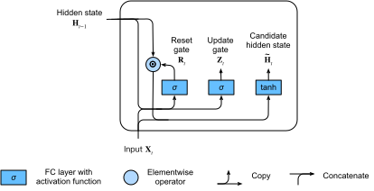

# ゲート付き再帰ユニット（GRU）
:label:`sec_gru`


2010年代にRNN、特にLSTMアーキテクチャ（:numref:`sec_lstm`）が急速に普及するにつれて、
多くの研究者が、内部状態と乗算的なゲーティング機構を組み込むという重要なアイデアを保ちながら、
計算を高速化することを目指して、より単純化したアーキテクチャの実験を始めた。
ゲート付き再帰ユニット（GRU） :cite:`Cho.Van-Merrienboer.Bahdanau.ea.2014` は、
LSTMのメモリセルを簡潔にした版を提供し、
しばしば同等の性能を達成しつつ、
計算がより高速であるという利点を持つ :cite:`Chung.Gulcehre.Cho.ea.2014`。

```{.python .input  n=5}
%load_ext d2lbook.tab
tab.interact_select(['mxnet', 'pytorch', 'tensorflow', 'jax'])
```

```{.python .input  n=6}
%%tab mxnet
from d2l import mxnet as d2l
from mxnet import np, npx
from mxnet.gluon import rnn
npx.set_np()
```

```{.python .input  n=7}
%%tab pytorch
from d2l import torch as d2l
import torch
from torch import nn
```

```{.python .input  n=8}
%%tab tensorflow
from d2l import tensorflow as d2l
import tensorflow as tf
```

```{.python .input}
%%tab jax
from d2l import jax as d2l
from flax import linen as nn
import jax
from jax import numpy as jnp
```

## リセットゲートと更新ゲート

ここでは、LSTMの3つのゲートを2つに置き換える。
それが*リセットゲート*と*更新ゲート*である。
LSTMと同様に、これらのゲートにはシグモイド活性化が与えられ、
その値は区間$(0, 1)$に制限される。
直感的には、リセットゲートは、前の状態のうちどれだけをまだ記憶しておきたいかを制御する。
同様に、更新ゲートは、新しい状態のうちどれだけが古い状態の単なるコピーであるかを制御できるようにする。
:numref:`fig_gru_1` は、現在の時刻の入力と前時刻の隠れ状態が与えられたときの、
GRUにおけるリセットゲートと更新ゲートの両方への入力を示している。
ゲートの出力は、シグモイド活性化関数を持つ2つの全結合層によって与えられる。


:label:`fig_gru_1`

数学的には、ある時刻$t$に対して、
入力がミニバッチ
$\mathbf{X}_t \in \mathbb{R}^{n \times d}$ 
（例の数 $=n$、入力数 $=d$）
であり、前時刻の隠れ状態が
$\mathbf{H}_{t-1} \in \mathbb{R}^{n \times h}$ 
（隠れユニット数 $=h$）
であるとする。
このとき、リセットゲート$\mathbf{R}_t \in \mathbb{R}^{n \times h}$ 
と更新ゲート$\mathbf{Z}_t \in \mathbb{R}^{n \times h}$ は次のように計算される：

$$
\begin{aligned}
\mathbf{R}_t = \sigma(\mathbf{X}_t \mathbf{W}_{\textrm{xr}} + \mathbf{H}_{t-1} \mathbf{W}_{\textrm{hr}} + \mathbf{b}_\textrm{r}),\\
\mathbf{Z}_t = \sigma(\mathbf{X}_t \mathbf{W}_{\textrm{xz}} + \mathbf{H}_{t-1} \mathbf{W}_{\textrm{hz}} + \mathbf{b}_\textrm{z}),
\end{aligned}
$$

ここで、$\mathbf{W}_{\textrm{xr}}, \mathbf{W}_{\textrm{xz}} \in \mathbb{R}^{d \times h}$ 
および $\mathbf{W}_{\textrm{hr}}, \mathbf{W}_{\textrm{hz}} \in \mathbb{R}^{h \times h}$ 
は重みパラメータであり、$\mathbf{b}_\textrm{r}, \mathbf{b}_\textrm{z} \in \mathbb{R}^{1 \times h}$ 
はバイアスパラメータである。


## 候補隠れ状態

次に、リセットゲート$\mathbf{R}_t$を
:eqref:`rnn_h_with_state` における通常の更新機構と統合し、
時刻$t$における次の
*候補隠れ状態*
$\tilde{\mathbf{H}}_t \in \mathbb{R}^{n \times h}$ を得る：

$$\tilde{\mathbf{H}}_t = \tanh(\mathbf{X}_t \mathbf{W}_{\textrm{xh}} + \left(\mathbf{R}_t \odot \mathbf{H}_{t-1}\right) \mathbf{W}_{\textrm{hh}} + \mathbf{b}_\textrm{h}),$$
:eqlabel:`gru_tilde_H`

ここで、$\mathbf{W}_{\textrm{xh}} \in \mathbb{R}^{d \times h}$ および $\mathbf{W}_{\textrm{hh}} \in \mathbb{R}^{h \times h}$
は重みパラメータ、
$\mathbf{b}_\textrm{h} \in \mathbb{R}^{1 \times h}$
はバイアスであり、
記号$\odot$はハダマード積（要素ごとの積）演算子である。
ここではtanh活性化関数を用いる。

これはまだ*候補*である。なぜなら、更新ゲートの働きをまだ組み込む必要があるからである。
:eqref:`rnn_h_with_state` と比較すると、
前の状態の影響は、
:eqref:`gru_tilde_H` における
$\mathbf{R}_t$ と $\mathbf{H}_{t-1}$ の要素ごとの乗算によって
抑えられるようになっている。
リセットゲート$\mathbf{R}_t$の各要素が1に近いとき、
:eqref:`rnn_h_with_state` のような通常のRNNが復元される。
リセットゲート$\mathbf{R}_t$の各要素が0に近いとき、
候補隠れ状態は$\mathbf{X}_t$を入力とするMLPの結果になる。
したがって、既存の隠れ状態はデフォルト値に*リセット*される。

:numref:`fig_gru_2` は、リセットゲートを適用した後の計算の流れを示している。


:label:`fig_gru_2`


## 隠れ状態

最後に、更新ゲート$\mathbf{Z}_t$の効果を組み込む必要がある。
これは、新しい隠れ状態$\mathbf{H}_t \in \mathbb{R}^{n \times h}$ が古い状態$\mathbf{H}_{t-1}$にどの程度一致するかと、
新しい候補状態$\tilde{\mathbf{H}}_t$にどの程度似るかを決定する。
更新ゲート$\mathbf{Z}_t$は、この目的のために、
$\mathbf{H}_{t-1}$と$\tilde{\mathbf{H}}_t$の要素ごとの凸結合を取るだけで用いることができる。
これにより、GRUの最終的な更新式は次のようになる：

$$\mathbf{H}_t = \mathbf{Z}_t \odot \mathbf{H}_{t-1}  + (1 - \mathbf{Z}_t) \odot \tilde{\mathbf{H}}_t.$$


更新ゲート$\mathbf{Z}_t$が1に近いときは、
単に古い状態を保持する。
この場合、$\mathbf{X}_t$からの情報は無視され、
依存関係の連鎖において時刻$t$が実質的にスキップされる。
対照的に、$\mathbf{Z}_t$が0に近いときは、
新しい潜在状態$\mathbf{H}_t$は候補潜在状態$\tilde{\mathbf{H}}_t$に近づく。
:numref:`fig_gru_3` は、更新ゲートが働いた後の計算の流れを示している。


:label:`fig_gru_3`


要約すると、GRUには次の2つの特徴がある：

* リセットゲートは、系列における短期依存関係の捕捉に役立つ。
* 更新ゲートは、系列における長期依存関係の捕捉に役立つ。

## ゼロからの実装

GRUモデルをよりよく理解するために、ゼロから実装してみよう。

### [**モデルパラメータの初期化**]

最初のステップは、モデルパラメータを初期化することである。
重みは標準偏差が`sigma`のガウス分布からサンプリングし、バイアスは0に設定する。
ハイパーパラメータ`num_hiddens`は隠れユニット数を定義する。
更新ゲート、リセットゲート、候補隠れ状態に関するすべての重みとバイアスをインスタンス化する。

```{.python .input}
%%tab pytorch, mxnet, tensorflow
class GRUScratch(d2l.Module):
    def __init__(self, num_inputs, num_hiddens, sigma=0.01):
        super().__init__()
        self.save_hyperparameters()
        
        if tab.selected('mxnet'):
            init_weight = lambda *shape: d2l.randn(*shape) * sigma
            triple = lambda: (init_weight(num_inputs, num_hiddens),
                              init_weight(num_hiddens, num_hiddens),
                              d2l.zeros(num_hiddens))            
        if tab.selected('pytorch'):
            init_weight = lambda *shape: nn.Parameter(d2l.randn(*shape) * sigma)
            triple = lambda: (init_weight(num_inputs, num_hiddens),
                              init_weight(num_hiddens, num_hiddens),
                              nn.Parameter(d2l.zeros(num_hiddens)))
        if tab.selected('tensorflow'):
            init_weight = lambda *shape: tf.Variable(d2l.normal(shape) * sigma)
            triple = lambda: (init_weight(num_inputs, num_hiddens),
                              init_weight(num_hiddens, num_hiddens),
                              tf.Variable(d2l.zeros(num_hiddens)))            
            
        self.W_xz, self.W_hz, self.b_z = triple()  # Update gate
        self.W_xr, self.W_hr, self.b_r = triple()  # Reset gate
        self.W_xh, self.W_hh, self.b_h = triple()  # Candidate hidden state        
```

```{.python .input}
%%tab jax
class GRUScratch(d2l.Module):
    num_inputs: int
    num_hiddens: int
    sigma: float = 0.01

    def setup(self):
        init_weight = lambda name, shape: self.param(name,
                                                     nn.initializers.normal(self.sigma),
                                                     shape)
        triple = lambda name : (
            init_weight(f'W_x{name}', (self.num_inputs, self.num_hiddens)),
            init_weight(f'W_h{name}', (self.num_hiddens, self.num_hiddens)),
            self.param(f'b_{name}', nn.initializers.zeros, (self.num_hiddens)))

        self.W_xz, self.W_hz, self.b_z = triple('z')  # Update gate
        self.W_xr, self.W_hr, self.b_r = triple('r')  # Reset gate
        self.W_xh, self.W_hh, self.b_h = triple('h')  # Candidate hidden state
```

### モデルの定義

これで[**GRUの順伝播計算を定義**]する準備が整った。
その構造は基本的なRNNセルと同じだが、更新式がより複雑である。

```{.python .input}
%%tab pytorch, mxnet, tensorflow
@d2l.add_to_class(GRUScratch)
def forward(self, inputs, H=None):
    if H is None:
        # Initial state with shape: (batch_size, num_hiddens)
        if tab.selected('mxnet'):
            H = d2l.zeros((inputs.shape[1], self.num_hiddens),
                          ctx=inputs.ctx)
        if tab.selected('pytorch'):
            H = d2l.zeros((inputs.shape[1], self.num_hiddens),
                          device=inputs.device)
        if tab.selected('tensorflow'):
            H = d2l.zeros((inputs.shape[1], self.num_hiddens))
    outputs = []
    for X in inputs:
        Z = d2l.sigmoid(d2l.matmul(X, self.W_xz) +
                        d2l.matmul(H, self.W_hz) + self.b_z)
        R = d2l.sigmoid(d2l.matmul(X, self.W_xr) + 
                        d2l.matmul(H, self.W_hr) + self.b_r)
        H_tilde = d2l.tanh(d2l.matmul(X, self.W_xh) + 
                           d2l.matmul(R * H, self.W_hh) + self.b_h)
        H = Z * H + (1 - Z) * H_tilde
        outputs.append(H)
    return outputs, H
```

```{.python .input}
%%tab jax
@d2l.add_to_class(GRUScratch)
def forward(self, inputs, H=None):
    # Use lax.scan primitive instead of looping over the
    # inputs, since scan saves time in jit compilation
    def scan_fn(H, X):
        Z = d2l.sigmoid(d2l.matmul(X, self.W_xz) + d2l.matmul(H, self.W_hz) +
                        self.b_z)
        R = d2l.sigmoid(d2l.matmul(X, self.W_xr) +
                        d2l.matmul(H, self.W_hr) + self.b_r)
        H_tilde = d2l.tanh(d2l.matmul(X, self.W_xh) +
                           d2l.matmul(R * H, self.W_hh) + self.b_h)
        H = Z * H + (1 - Z) * H_tilde
        return H, H  # return carry, y

    if H is None:
        batch_size = inputs.shape[1]
        carry = jnp.zeros((batch_size, self.num_hiddens))
    else:
        carry = H

    # scan takes the scan_fn, initial carry state, xs with leading axis to be scanned
    carry, outputs = jax.lax.scan(scan_fn, carry, inputs)
    return outputs, carry
```

### 学習

*タイムマシン*データセット上で言語モデルを[**学習**]する方法は、
:numref:`sec_rnn-scratch` とまったく同じである。

```{.python .input}
%%tab all
data = d2l.TimeMachine(batch_size=1024, num_steps=32)
if tab.selected('mxnet', 'pytorch', 'jax'):
    gru = GRUScratch(num_inputs=len(data.vocab), num_hiddens=32)
    model = d2l.RNNLMScratch(gru, vocab_size=len(data.vocab), lr=4)
    trainer = d2l.Trainer(max_epochs=50, gradient_clip_val=1, num_gpus=1)
if tab.selected('tensorflow'):
    with d2l.try_gpu():
        gru = GRUScratch(num_inputs=len(data.vocab), num_hiddens=32)
        model = d2l.RNNLMScratch(gru, vocab_size=len(data.vocab), lr=4)
    trainer = d2l.Trainer(max_epochs=50, gradient_clip_val=1)
trainer.fit(model, data)
```

## [**簡潔な実装**]

高水準APIでは、GRUモデルを直接インスタンス化できる。
これにより、上で明示的に記述したすべての設定の詳細がカプセル化される。

```{.python .input}
%%tab pytorch, mxnet, tensorflow
class GRU(d2l.RNN):
    def __init__(self, num_inputs, num_hiddens):
        d2l.Module.__init__(self)
        self.save_hyperparameters()
        if tab.selected('mxnet'):
            self.rnn = rnn.GRU(num_hiddens)
        if tab.selected('pytorch'):
            self.rnn = nn.GRU(num_inputs, num_hiddens)
        if tab.selected('tensorflow'):
            self.rnn = tf.keras.layers.GRU(num_hiddens, return_sequences=True, 
                                           return_state=True)
```

```{.python .input}
%%tab jax
class GRU(d2l.RNN):
    num_hiddens: int

    @nn.compact
    def __call__(self, inputs, H=None, training=False):
        if H is None:
            batch_size = inputs.shape[1]
            H = nn.GRUCell.initialize_carry(jax.random.PRNGKey(0),
                                            (batch_size,), self.num_hiddens)

        GRU = nn.scan(nn.GRUCell, variable_broadcast="params",
                      in_axes=0, out_axes=0, split_rngs={"params": False})

        H, outputs = GRU()(H, inputs)
        return outputs, H
```

このコードは、Pythonではなくコンパイル済みオペレータを使用するため、学習時に大幅に高速である。

```{.python .input}
%%tab all
if tab.selected('mxnet', 'pytorch', 'tensorflow'):
    gru = GRU(num_inputs=len(data.vocab), num_hiddens=32)
if tab.selected('jax'):
    gru = GRU(num_hiddens=32)
if tab.selected('mxnet', 'pytorch', 'jax'):
    model = d2l.RNNLM(gru, vocab_size=len(data.vocab), lr=4)
if tab.selected('tensorflow'):
    with d2l.try_gpu():
        model = d2l.RNNLM(gru, vocab_size=len(data.vocab), lr=4)
trainer.fit(model, data)
```

学習後、訓練セット上のパープレキシティと、与えられた接頭辞に続く予測系列を出力する。

```{.python .input}
%%tab mxnet, pytorch
model.predict('it has', 20, data.vocab, d2l.try_gpu())
```

```{.python .input}
%%tab tensorflow
model.predict('it has', 20, data.vocab)
```

```{.python .input}
%%tab jax
model.predict('it has', 20, data.vocab, trainer.state.params)
```

## まとめ

LSTMと比べると、GRUは同程度の性能を達成しつつ、計算量が軽い傾向がある。
一般に、単純なRNNと比べると、ゲート付きRNNは、LSTMやGRUと同様に、
時間ステップ間の距離が大きい系列における依存関係をよりよく捉えられる。
GRUは、リセットゲートがオンになると、基本的なRNNを極限ケースとして含む。
また、更新ゲートをオンにすることで部分系列をスキップすることもできる。


## 演習

1. 時刻$t'$の入力だけを使って、時刻$t > t'$の出力を予測したいとする。各時刻におけるリセットゲートと更新ゲートの最適な値は何か。
1. ハイパーパラメータを調整し、実行時間、パープレキシティ、出力系列への影響を分析せよ。
1. `rnn.RNN` と `rnn.GRU` の実装について、実行時間、パープレキシティ、出力文字列を相互に比較せよ。
1. GRUの一部だけ、たとえばリセットゲートだけ、あるいは更新ゲートだけを実装するとどうなるか。\n
