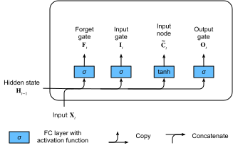
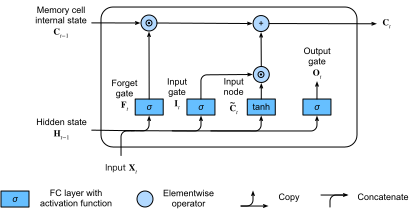

# 長短期記憶（LSTM）
:label:`sec_lstm`


最初の Elman 型 RNN が逆伝播を用いて学習された直後
:cite:`elman1990finding`、長期依存関係の学習における問題
（勾配消失と勾配爆発に起因する）が顕在化し、
Bengio と Hochreiter がこの問題について議論した
:cite:`bengio1994learning,Hochreiter.Bengio.Frasconi.ea.2001`。
Hochreiter はこの問題を 1991 年の修士論文の時点で既に明確に述べていたが、
その論文はドイツ語で書かれていたため、結果は広く知られていなかった。
勾配クリッピングは勾配爆発には有効だが、
勾配消失への対処には、より精巧な解決策が必要であるように見える。
勾配消失に対処する最初期かつ最も成功した手法の一つが、
:citet:`Hochreiter.Schmidhuber.1997` による長短期記憶（LSTM）モデルである。
LSTM は標準的な再帰ニューラルネットワークに似ているが、
ここでは通常の再帰ノードがそれぞれ *記憶セル* に置き換えられている。
各記憶セルは *内部状態* を含み、
すなわち、重みが 1 に固定された自己接続の再帰辺を持つノードであり、
勾配が消失も爆発もせずに多数の時間ステップをまたいで伝播できることを保証する。

「長短期記憶」という用語は、次の直感に由来する。
単純な再帰ニューラルネットワークは、重みという形で *長期記憶* を持つ。
重みは学習中にゆっくり変化し、データに関する一般的な知識を符号化する。
また、各ノードから次のノードへと受け渡される一時的な活性という形で
*短期記憶* も持つ。
LSTM モデルは、記憶セルを通じて中間的な種類の記憶を導入する。
記憶セルは、より単純なノードから
特定の接続パターンで構成された複合ユニットであり、
乗算ノードが新たに組み込まれている。

```{.python .input}
%load_ext d2lbook.tab
tab.interact_select(['mxnet', 'pytorch', 'tensorflow', 'jax'])
```

```{.python .input}
%%tab mxnet
from d2l import mxnet as d2l
from mxnet import np, npx
from mxnet.gluon import rnn
npx.set_np()
```

```{.python .input}
%%tab pytorch
from d2l import torch as d2l
import torch
from torch import nn
```

```{.python .input}
%%tab tensorflow
from d2l import tensorflow as d2l
import tensorflow as tf
```

```{.python .input}
%%tab jax
from d2l import jax as d2l
from flax import linen as nn
import jax
from jax import numpy as jnp
```

## ゲート付き記憶セル

各記憶セルは *内部状態* と、いくつかの乗算ゲートを備えている。
これらのゲートは、
(i) 与えられた入力を内部状態に反映させるべきか（*入力ゲート*）、
(ii) 内部状態を $0$ に消去すべきか（*忘却ゲート*）、
(iii) 与えられたニューロンの内部状態をセルの出力に反映させるべきか（*出力ゲート*）
を決定する。


### ゲート付き隠れ状態

素朴な RNN と LSTM の重要な違いは、
後者が隠れ状態のゲーティングをサポートする点にある。
これは、隠れ状態をいつ *更新* すべきか、
またいつ *リセット* すべきかのための専用機構があることを意味する。
これらの機構は学習され、上で述べた懸念に対処する。
たとえば、最初のトークンが非常に重要であれば、
最初の観測以降は隠れ状態を更新しないように学習される。
同様に、無関係な一時的観測を飛ばすように学習される。
最後に、必要に応じて潜在状態をリセットするように学習される。
これについては以下で詳しく説明する。

### 入力ゲート、忘却ゲート、出力ゲート

LSTM のゲートに入力されるデータは、
現在の時間ステップの入力と
前の時間ステップの隠れ状態であり、
:numref:`fig_lstm_0` に示されている。
シグモイド活性化関数を持つ 3 つの全結合層が、
入力ゲート、忘却ゲート、出力ゲートの値を計算する。
シグモイド活性化の結果、
3 つのゲートの値はすべて $(0, 1)$ の範囲に入る。
さらに、*入力ノード* が必要であり、
通常は *tanh* 活性化関数で計算される。
直感的には、*入力ゲート* は
入力ノードの値のどれだけを
現在の記憶セル内部状態に加えるべきかを決定する。
*忘却ゲート* は、現在の記憶を保持するか消去するかを決定する。
そして *出力ゲート* は、
記憶セルが現在の時間ステップにおける出力へ影響を与えるべきかを決定する。


:label:`fig_lstm_0`

数学的には、隠れユニット数が $h$、バッチサイズが $n$、入力数が $d$ であるとする。
したがって、入力は $\mathbf{X}_t \in \mathbb{R}^{n \times d}$、
前の時間ステップの隠れ状態は $\mathbf{H}_{t-1} \in \mathbb{R}^{n \times h}$ である。
対応して、時間ステップ $t$ におけるゲートは次のように定義される。
入力ゲートは $\mathbf{I}_t \in \mathbb{R}^{n \times h}$、
忘却ゲートは $\mathbf{F}_t \in \mathbb{R}^{n \times h}$、
出力ゲートは $\mathbf{O}_t \in \mathbb{R}^{n \times h}$ である。
これらは次のように計算される。

$$
\begin{aligned}
\mathbf{I}_t &= \sigma(\mathbf{X}_t \mathbf{W}_{\textrm{xi}} + \mathbf{H}_{t-1} \mathbf{W}_{\textrm{hi}} + \mathbf{b}_\textrm{i}),\\
\mathbf{F}_t &= \sigma(\mathbf{X}_t \mathbf{W}_{\textrm{xf}} + \mathbf{H}_{t-1} \mathbf{W}_{\textrm{hf}} + \mathbf{b}_\textrm{f}),\\
\mathbf{O}_t &= \sigma(\mathbf{X}_t \mathbf{W}_{\textrm{xo}} + \mathbf{H}_{t-1} \mathbf{W}_{\textrm{ho}} + \mathbf{b}_\textrm{o}),
\end{aligned}
$$

ここで、$\mathbf{W}_{\textrm{xi}}, \mathbf{W}_{\textrm{xf}}, \mathbf{W}_{\textrm{xo}} \in \mathbb{R}^{d \times h}$ および $\mathbf{W}_{\textrm{hi}}, \mathbf{W}_{\textrm{hf}}, \mathbf{W}_{\textrm{ho}} \in \mathbb{R}^{h \times h}$ は重みパラメータであり、
$\mathbf{b}_\textrm{i}, \mathbf{b}_\textrm{f}, \mathbf{b}_\textrm{o} \in \mathbb{R}^{1 \times h}$ はバイアスパラメータである。
加算の際にブロードキャスト
（:numref:`subsec_broadcasting` を参照）
が発生することに注意されたい。
入力値を区間 $(0, 1)$ に写像するために、
（:numref:`sec_mlp` で導入した）シグモイド関数を用いる。


### 入力ノード

次に記憶セルを設計する。
まだ各ゲートの働きを定義していないので、
まず *入力ノード*
$\tilde{\mathbf{C}}_t \in \mathbb{R}^{n \times h}$ を導入する。
その計算は上で述べた 3 つのゲートと似ているが、
活性化関数として値域が $(-1, 1)$ の $\tanh$ 関数を用いる。
これにより、時間ステップ $t$ における次の式が得られる。

$$\tilde{\mathbf{C}}_t = \textrm{tanh}(\mathbf{X}_t \mathbf{W}_{\textrm{xc}} + \mathbf{H}_{t-1} \mathbf{W}_{\textrm{hc}} + \mathbf{b}_\textrm{c}),$$

ここで、$\mathbf{W}_{\textrm{xc}} \in \mathbb{R}^{d \times h}$ および $\mathbf{W}_{\textrm{hc}} \in \mathbb{R}^{h \times h}$ は重みパラメータであり、$\mathbf{b}_\textrm{c} \in \mathbb{R}^{1 \times h}$ はバイアスパラメータである。

入力ノードの簡単な図を :numref:`fig_lstm_1` に示す。


:label:`fig_lstm_1`


### 記憶セル内部状態

LSTM では、入力ゲート $\mathbf{I}_t$ が
$\tilde{\mathbf{C}}_t$ を通じて新しいデータをどれだけ考慮するかを制御し、
忘却ゲート $\mathbf{F}_t$ が
古いセル内部状態 $\mathbf{C}_{t-1} \in \mathbb{R}^{n \times h}$ のどれだけを保持するかを扱う。
Hadamard（要素ごと）積演算子 $\odot$ を用いると、
次の更新式が得られる。

$$\mathbf{C}_t = \mathbf{F}_t \odot \mathbf{C}_{t-1} + \mathbf{I}_t \odot \tilde{\mathbf{C}}_t.$$

忘却ゲートが常に 1 で入力ゲートが常に 0 であれば、
記憶セル内部状態 $\mathbf{C}_{t-1}$ は永遠に一定のまま保たれ、
そのまま各後続時間ステップへ受け渡される。
しかし、入力ゲートと忘却ゲートにより、
モデルはこの値をいつ不変に保ち、
いつ後続入力に応じて変化させるかを学習できる柔軟性を持つ。
実際、この設計は勾配消失問題を緩和し、
特に長い系列長を持つデータセットに対して、
はるかに学習しやすいモデルを実現する。

これにより、 :numref:`fig_lstm_2` のフローダイアグラムが得られる。



:label:`fig_lstm_2`


### 隠れ状態

最後に、他の層から見える記憶セルの出力、
すなわち隠れ状態 $\mathbf{H}_t \in \mathbb{R}^{n \times h}$ をどのように計算するかを定義する必要がある。
ここで出力ゲートが関与する。
LSTM では、まず記憶セル内部状態に $\tanh$ を適用し、
その後、今度は出力ゲートとの要素ごとの乗算を行う。
これにより、$\mathbf{H}_t$ の値は常に区間 $(-1, 1)$ に収まる。

$$\mathbf{H}_t = \mathbf{O}_t \odot \tanh(\mathbf{C}_t).$$


出力ゲートが 1 に近いときは、
記憶セル内部状態が制約なく後続層に影響を与えることを許し、
一方で出力ゲートの値が 0 に近いときは、
現在の記憶がその時間ステップにおいてネットワークの他の層へ影響するのを防ぐ。
記憶セルは、出力ゲートが 0 に近い値を取る限り、
ネットワークの残りに影響を与えずに多数の時間ステップにわたって情報を蓄積でき、
その後、出力ゲートが 0 に近い値から 1 に近い値へ切り替わると同時に、
次の時間ステップで突然ネットワークに影響を与えることができる。
データの流れの図示を :numref:`fig_lstm_3` に示す。


:label:`fig_lstm_3`


## ゼロからの実装

それでは、LSTM をゼロから実装しよう。
:numref:`sec_rnn-scratch` の実験と同様に、
まず *Time Machine* データセットを読み込む。

### [**モデルパラメータの初期化**]

次に、モデルパラメータを定義し初期化する必要がある。
前と同様に、ハイパーパラメータ `num_hiddens` が
隠れユニット数を決定する。
重みは標準偏差 0.01 のガウス分布に従って初期化し、
バイアスは 0 に設定する。

```{.python .input}
%%tab pytorch, mxnet, tensorflow
class LSTMScratch(d2l.Module):
    def __init__(self, num_inputs, num_hiddens, sigma=0.01):
        super().__init__()
        self.save_hyperparameters()

        if tab.selected('mxnet'):
            init_weight = lambda *shape: d2l.randn(*shape) * sigma
            triple = lambda: (init_weight(num_inputs, num_hiddens),
                              init_weight(num_hiddens, num_hiddens),
                              d2l.zeros(num_hiddens))
        if tab.selected('pytorch'):
            init_weight = lambda *shape: nn.Parameter(d2l.randn(*shape) * sigma)
            triple = lambda: (init_weight(num_inputs, num_hiddens),
                              init_weight(num_hiddens, num_hiddens),
                              nn.Parameter(d2l.zeros(num_hiddens)))
        if tab.selected('tensorflow'):
            init_weight = lambda *shape: tf.Variable(d2l.normal(shape) * sigma)
            triple = lambda: (init_weight(num_inputs, num_hiddens),
                              init_weight(num_hiddens, num_hiddens),
                              tf.Variable(d2l.zeros(num_hiddens)))

        self.W_xi, self.W_hi, self.b_i = triple()  # Input gate
        self.W_xf, self.W_hf, self.b_f = triple()  # Forget gate
        self.W_xo, self.W_ho, self.b_o = triple()  # Output gate
        self.W_xc, self.W_hc, self.b_c = triple()  # Input node
```

```{.python .input}
%%tab jax
class LSTMScratch(d2l.Module):
    num_inputs: int
    num_hiddens: int
    sigma: float = 0.01

    def setup(self):
        init_weight = lambda name, shape: self.param(name,
                                                     nn.initializers.normal(self.sigma),
                                                     shape)
        triple = lambda name : (
            init_weight(f'W_x{name}', (self.num_inputs, self.num_hiddens)),
            init_weight(f'W_h{name}', (self.num_hiddens, self.num_hiddens)),
            self.param(f'b_{name}', nn.initializers.zeros, (self.num_hiddens)))

        self.W_xi, self.W_hi, self.b_i = triple('i')  # Input gate
        self.W_xf, self.W_hf, self.b_f = triple('f')  # Forget gate
        self.W_xo, self.W_ho, self.b_o = triple('o')  # Output gate
        self.W_xc, self.W_hc, self.b_c = triple('c')  # Input node
```

:begin_tab:`pytorch, mxnet, tensorflow`
[**実際のモデル**] は上で述べたとおり、
3 つのゲートと 1 つの入力ノードから構成される。
なお、出力層に渡されるのは隠れ状態のみである。
:end_tab:

:begin_tab:`jax`
[**実際のモデル**] は上で述べたとおり、
3 つのゲートと 1 つの入力ノードから構成される。
なお、出力層に渡されるのは隠れ状態のみである。
`forward` メソッド内の長い for ループは、最初の実行時に非常に長い JIT コンパイル時間を招く。
これに対処するため、各時間ステップで状態を更新するのに for ループを使う代わりに、
JAX では `jax.lax.scan` ユーティリティ変換を用いて同じ動作を実現できる。
これは、`carry` と呼ばれる初期状態と、
先頭軸に沿って走査される `inputs` 配列を受け取る。
`scan` 変換は最終的に、期待どおり最終状態とスタックされた出力を返す。
:end_tab:

```{.python .input}
%%tab pytorch, mxnet, tensorflow
@d2l.add_to_class(LSTMScratch)
def forward(self, inputs, H_C=None):
    if H_C is None:
        # Initial state with shape: (batch_size, num_hiddens)
        if tab.selected('mxnet'):
            H = d2l.zeros((inputs.shape[1], self.num_hiddens),
                          ctx=inputs.ctx)
            C = d2l.zeros((inputs.shape[1], self.num_hiddens),
                          ctx=inputs.ctx)
        if tab.selected('pytorch'):
            H = d2l.zeros((inputs.shape[1], self.num_hiddens),
                          device=inputs.device)
            C = d2l.zeros((inputs.shape[1], self.num_hiddens),
                          device=inputs.device)
        if tab.selected('tensorflow'):
            H = d2l.zeros((inputs.shape[1], self.num_hiddens))
            C = d2l.zeros((inputs.shape[1], self.num_hiddens))
    else:
        H, C = H_C
    outputs = []
    for X in inputs:
        I = d2l.sigmoid(d2l.matmul(X, self.W_xi) +
                        d2l.matmul(H, self.W_hi) + self.b_i)
        F = d2l.sigmoid(d2l.matmul(X, self.W_xf) +
                        d2l.matmul(H, self.W_hf) + self.b_f)
        O = d2l.sigmoid(d2l.matmul(X, self.W_xo) +
                        d2l.matmul(H, self.W_ho) + self.b_o)
        C_tilde = d2l.tanh(d2l.matmul(X, self.W_xc) +
                           d2l.matmul(H, self.W_hc) + self.b_c)
        C = F * C + I * C_tilde
        H = O * d2l.tanh(C)
        outputs.append(H)
    return outputs, (H, C)
```

```{.python .input}
%%tab jax
@d2l.add_to_class(LSTMScratch)
def forward(self, inputs, H_C=None):
    # Use lax.scan primitive instead of looping over the
    # inputs, since scan saves time in jit compilation.
    def scan_fn(carry, X):
        H, C = carry
        I = d2l.sigmoid(d2l.matmul(X, self.W_xi) + (
            d2l.matmul(H, self.W_hi)) + self.b_i)
        F = d2l.sigmoid(d2l.matmul(X, self.W_xf) +
                        d2l.matmul(H, self.W_hf) + self.b_f)
        O = d2l.sigmoid(d2l.matmul(X, self.W_xo) +
                        d2l.matmul(H, self.W_ho) + self.b_o)
        C_tilde = d2l.tanh(d2l.matmul(X, self.W_xc) +
                           d2l.matmul(H, self.W_hc) + self.b_c)
        C = F * C + I * C_tilde
        H = O * d2l.tanh(C)
        return (H, C), H  # return carry, y

    if H_C is None:
        batch_size = inputs.shape[1]
        carry = jnp.zeros((batch_size, self.num_hiddens)), \
                jnp.zeros((batch_size, self.num_hiddens))
    else:
        carry = H_C

    # scan takes the scan_fn, initial carry state, xs with leading axis to be scanned
    carry, outputs = jax.lax.scan(scan_fn, carry, inputs)
    return outputs, carry
```

### [**学習**] と予測

:numref:`sec_rnn-scratch` の `RNNLMScratch` クラスをインスタンス化して、
LSTM モデルを学習しよう。

```{.python .input}
%%tab all
data = d2l.TimeMachine(batch_size=1024, num_steps=32)
if tab.selected('mxnet', 'pytorch', 'jax'):
    lstm = LSTMScratch(num_inputs=len(data.vocab), num_hiddens=32)
    model = d2l.RNNLMScratch(lstm, vocab_size=len(data.vocab), lr=4)
    trainer = d2l.Trainer(max_epochs=50, gradient_clip_val=1, num_gpus=1)
if tab.selected('tensorflow'):
    with d2l.try_gpu():
        lstm = LSTMScratch(num_inputs=len(data.vocab), num_hiddens=32)
        model = d2l.RNNLMScratch(lstm, vocab_size=len(data.vocab), lr=4)
    trainer = d2l.Trainer(max_epochs=50, gradient_clip_val=1)
trainer.fit(model, data)
```

## [**簡潔な実装**]

高水準 API を用いれば、
LSTM モデルを直接インスタンス化できる。
これにより、上で明示的に行ったすべての設定詳細がカプセル化される。
ここまでで述べた多くの詳細について Python ではなくコンパイル済み演算子を使うため、
コードは大幅に高速である。

```{.python .input}
%%tab mxnet
class LSTM(d2l.RNN):
    def __init__(self, num_hiddens):
        d2l.Module.__init__(self)
        self.save_hyperparameters()
        self.rnn = rnn.LSTM(num_hiddens)

    def forward(self, inputs, H_C=None):
        if H_C is None: H_C = self.rnn.begin_state(
            inputs.shape[1], ctx=inputs.ctx)
        return self.rnn(inputs, H_C)
```

```{.python .input}
%%tab pytorch
class LSTM(d2l.RNN):
    def __init__(self, num_inputs, num_hiddens):
        d2l.Module.__init__(self)
        self.save_hyperparameters()
        self.rnn = nn.LSTM(num_inputs, num_hiddens)

    def forward(self, inputs, H_C=None):
        return self.rnn(inputs, H_C)
```

```{.python .input}
%%tab tensorflow
class LSTM(d2l.RNN):
    def __init__(self, num_hiddens):
        d2l.Module.__init__(self)
        self.save_hyperparameters()
        self.rnn = tf.keras.layers.LSTM(
                num_hiddens, return_sequences=True,
                return_state=True, time_major=True)

    def forward(self, inputs, H_C=None):
        outputs, *H_C = self.rnn(inputs, H_C)
        return outputs, H_C
```

```{.python .input}
%%tab jax
class LSTM(d2l.RNN):
    num_hiddens: int

    @nn.compact
    def __call__(self, inputs, H_C=None, training=False):
        if H_C is None:
            batch_size = inputs.shape[1]
            H_C = nn.OptimizedLSTMCell.initialize_carry(jax.random.PRNGKey(0),
                                                        (batch_size,),
                                                        self.num_hiddens)

        LSTM = nn.scan(nn.OptimizedLSTMCell, variable_broadcast="params",
                       in_axes=0, out_axes=0, split_rngs={"params": False})

        H_C, outputs = LSTM()(H_C, inputs)
        return outputs, H_C
```

```{.python .input}
%%tab all
if tab.selected('pytorch'):
    lstm = LSTM(num_inputs=len(data.vocab), num_hiddens=32)
if tab.selected('mxnet', 'tensorflow', 'jax'):
    lstm = LSTM(num_hiddens=32)
if tab.selected('mxnet', 'pytorch', 'jax'):
    model = d2l.RNNLM(lstm, vocab_size=len(data.vocab), lr=4)
if tab.selected('tensorflow'):
    with d2l.try_gpu():
        model = d2l.RNNLM(lstm, vocab_size=len(data.vocab), lr=4)
trainer.fit(model, data)
```

```{.python .input}
%%tab mxnet, pytorch
model.predict('it has', 20, data.vocab, d2l.try_gpu())
```

```{.python .input}
%%tab tensorflow
model.predict('it has', 20, data.vocab)
```

```{.python .input}
%%tab jax
model.predict('it has', 20, data.vocab, trainer.state.params)
```

LSTM は、非自明な状態制御を備えた潜在変数自己回帰モデルの典型例である。
長年にわたり、その多様な変種が提案されてきた。たとえば、多層化、残差接続、さまざまな正則化手法などである。
しかし、系列の長距離依存性のため、LSTM や他の系列モデル（GRU など）の学習はかなりコストが高い。
後の章では、場合によっては利用できる Transformer などの代替モデルに出会うことになる。


## まとめ

LSTM は 1997 年に発表されたが、
2000 年代半ばの予測コンペティションでいくつかの勝利を収めたことで大きく注目され、
2011 年から 2017 年に Transformer モデルが台頭するまで、
系列学習の支配的なモデルとなった。
Transformer でさえ、その重要なアイデアのいくつかは、
LSTM によって導入されたアーキテクチャ設計上の革新に負っている。


LSTM には 3 種類のゲートがある。
入力ゲート、忘却ゲート、出力ゲートであり、
情報の流れを制御する。
LSTM の隠れ層出力には隠れ状態と記憶セル内部状態が含まれる。
出力層に渡されるのは隠れ状態のみであり、
記憶セル内部状態は完全に内部にとどまる。
LSTM は勾配消失と勾配爆発を緩和できる。


## 演習

1. ハイパーパラメータを調整し、実行時間、パープレキシティ、出力系列への影響を分析せよ。
1. 文字列の系列ではなく、適切な単語を生成するには、モデルをどのように変更する必要があるか。
1. 与えられた隠れ次元に対して、GRU、LSTM、通常の RNN の計算コストを比較せよ。特に学習時と推論時のコストに注意せよ。
1. 候補記憶セルは $\tanh$ 関数を用いて値域を $-1$ から $1$ に保つのに、なぜ隠れ状態でも再び $\tanh$ 関数を用いて出力値域を $-1$ から $1$ に保つ必要があるのか。
1. 文字系列予測ではなく、時系列予測のための LSTM モデルを実装せよ。
