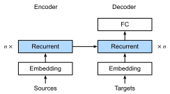

{.python .input}
%load_ext d2lbook.tab
tab.interact_select('mxnet', 'pytorch', 'tensorflow', 'jax')
```

#  機械翻訳のためのシーケンス・ツー・シーケンス学習
:label:`sec_seq2seq`

いわゆるシーケンス・ツー・シーケンス問題、たとえば機械翻訳
(:numref:`sec_machine_translation` で議論したように) では、
入力と出力がそれぞれ
長さ可変で対応の取れていない系列から構成されるため、
一般にエンコーダ--デコーダアーキテクチャ
(:numref:`sec_encoder-decoder`) に依拠します。
この節では、
エンコーダとデコーダの両方をRNNとして実装した
エンコーダ--デコーダアーキテクチャを、
機械翻訳のタスクに適用する例を示します
:cite:`Sutskever.Vinyals.Le.2014,Cho.Van-Merrienboer.Gulcehre.ea.2014`。

ここで、エンコーダRNNは長さ可変の系列を入力として受け取り、
それを固定形状の隠れ状態へ変換します。
後の :numref:`chap_attention-and-transformers` では、
系列全体を単一の固定長表現に圧縮しなくても
符号化された入力にアクセスできる
注意機構を導入します。

次に、出力系列を1トークンずつ生成するために、
別個のRNNからなるデコーダモデルが、
入力系列と出力側の前のトークンの両方を与えられて、
各時刻の次のターゲットトークンを予測します。
学習時には、デコーダは通常、
公式の「正解」ラベルにおける前のトークンを条件として与えられます。
しかしテスト時には、すでに予測済みのトークンを条件として
デコーダの各出力を生成したいと考えます。
なお、エンコーダを無視すれば、
シーケンス・ツー・シーケンスアーキテクチャのデコーダは
通常の言語モデルとまったく同じように振る舞います。
:numref:`fig_seq2seq` は、
機械翻訳におけるシーケンス・ツー・シーケンス学習で
2つのRNNをどのように使うかを示しています。


:label:`fig_seq2seq`

:numref:`fig_seq2seq` では、
特別な "&lt;eos&gt;" トークンが
系列の終端を示します。
このトークンが生成されると、
モデルは予測を停止できます。
RNNデコーダの初期時刻には、
注意すべき特別な設計上の決定が2つあります。
第1に、すべての入力の先頭に特別な
系列開始 "&lt;bos&gt;" トークンを置きます。
第2に、エンコーダの最終隠れ状態を
デコーダへ
各デコード時刻ごとに入力することもできます :cite:`Cho.Van-Merrienboer.Gulcehre.ea.2014`。
:citet:`Sutskever.Vinyals.Le.2014` のような別の設計では、
RNNエンコーダの最終隠れ状態は
デコーダの隠れ状態を初期化するために
最初のデコード時刻にのみ用いられます。

```{.python .input}
%%tab mxnet
import collections
from d2l import mxnet as d2l
import math
from mxnet import np, npx, init, gluon, autograd
from mxnet.gluon import nn, rnn
npx.set_np()
```

```{.python .input}
%%tab pytorch
import collections
from d2l import torch as d2l
import math
import torch
from torch import nn
from torch.nn import functional as F
```

```{.python .input}
%%tab tensorflow
import collections
from d2l import tensorflow as d2l
import math
import tensorflow as tf
```

```{.python .input}
%%tab jax
import collections
from d2l import jax as d2l
from flax import linen as nn
from functools import partial
import jax
from jax import numpy as jnp
import math
import optax
```

## Teacher Forcing

入力系列に対してエンコーダを実行するのは
比較的単純ですが、
デコーダの入力と出力の扱いには
より注意が必要です。
最も一般的な方法は、しばしば *teacher forcing* と呼ばれます。
ここでは、元のターゲット系列（トークンラベル）を
デコーダへの入力として与えます。
より具体的には、
特別な系列開始トークンと、
最後のトークンを除いた元のターゲット系列を
デコーダへの入力として連結し、
一方でデコーダの出力（学習用ラベル）は、
1トークンずらした元のターゲット系列になります:
"&lt;bos&gt;", "Ils", "regardent", "." $\rightarrow$
"Ils", "regardent", ".", "&lt;eos&gt;" (:numref:`fig_seq2seq`)。

:numref:`subsec_loading-seq-fixed-len` における実装では、
teacher forcing のための学習データを準備しました。
ここでのトークンのシフトは、
:numref:`sec_language-model` における言語モデルの学習と
同様の自己教師あり学習です。
別の方法としては、
前の時刻での *予測済み* トークンを
現在のデコーダ入力として与えることもできます。


以下では、 :numref:`fig_seq2seq` に示した設計を
より詳しく説明します。
このモデルは、
:numref:`sec_machine_translation` で導入した
英仏データセット上で機械翻訳のために学習します。

## エンコーダ

エンコーダは、長さ可変の入力系列を
固定形状の *コンテキスト変数* $\mathbf{c}$ に変換することを思い出してください
(:numref:`fig_seq2seq` を参照)。


単一の系列例（バッチサイズ1）を考えます。
入力系列が $x_1, \ldots, x_T$ であり、
$x_t$ が $t^{\textrm{th}}$ トークンだとします。
時刻 $t$ において、RNNは
$x_t$ に対応する入力特徴ベクトル $\mathbf{x}_t$ と
前時刻の隠れ状態 $\mathbf{h} _{t-1}$ を
現在の隠れ状態 $\mathbf{h}_t$ に変換します。
RNNの再帰層の変換は、
関数 $f$ を用いて次のように表せます。

$$\mathbf{h}_t = f(\mathbf{x}_t, \mathbf{h}_{t-1}). $$

一般に、エンコーダは
すべての時刻の隠れ状態を
カスタマイズされた関数 $q$ を通して
コンテキスト変数へ変換します。

$$\mathbf{c} =  q(\mathbf{h}_1, \ldots, \mathbf{h}_T).$$

たとえば、 :numref:`fig_seq2seq` では、
コンテキスト変数は単に隠れ状態 $\mathbf{h}_T$ であり、
入力系列の最後のトークンを処理した後の
エンコーダRNNの表現に対応します。

この例では、エンコーダの設計に
単方向RNNを用いており、
隠れ状態はその時刻までの入力部分系列のみに依存します。
双方向RNNを用いてエンコーダを構成することもできます。
この場合、隠れ状態はその時刻の前後の部分系列
（現在時刻の入力を含む）に依存し、
系列全体の情報を符号化します。


それでは、[**RNNエンコーダを実装**]しましょう。
入力系列の各トークンに対する特徴ベクトルを得るために、
*埋め込み層* を用いることに注意してください。
埋め込み層の重みは行列であり、
行数は入力語彙のサイズ (`vocab_size`) に対応し、
列数は特徴ベクトルの次元 (`embed_size`) に対応します。
任意の入力トークンのインデックス $i$ に対して、
埋め込み層は重み行列の
$i^{\textrm{th}}$ 行（0始まり）を取り出して
その特徴ベクトルを返します。
ここでは、エンコーダを多層GRUで実装します。

```{.python .input}
%%tab mxnet
class Seq2SeqEncoder(d2l.Encoder):  #@save
    """The RNN encoder for sequence-to-sequence learning."""
    def __init__(self, vocab_size, embed_size, num_hiddens, num_layers,
                 dropout=0):
        super().__init__()
        self.embedding = nn.Embedding(vocab_size, embed_size)
        self.rnn = d2l.GRU(num_hiddens, num_layers, dropout)
        self.initialize(init.Xavier())
            
    def forward(self, X, *args):
        # X shape: (batch_size, num_steps)
        embs = self.embedding(d2l.transpose(X))
        # embs shape: (num_steps, batch_size, embed_size)    
        outputs, state = self.rnn(embs)
        # outputs shape: (num_steps, batch_size, num_hiddens)
        # state shape: (num_layers, batch_size, num_hiddens)
        return outputs, state
```

```{.python .input}
%%tab pytorch
def init_seq2seq(module):  #@save
    """Initialize weights for sequence-to-sequence learning."""
    if type(module) == nn.Linear:
         nn.init.xavier_uniform_(module.weight)
    if type(module) == nn.GRU:
        for param in module._flat_weights_names:
            if "weight" in param:
                nn.init.xavier_uniform_(module._parameters[param])
```

```{.python .input}
%%tab pytorch
class Seq2SeqEncoder(d2l.Encoder):  #@save
    """The RNN encoder for sequence-to-sequence learning."""
    def __init__(self, vocab_size, embed_size, num_hiddens, num_layers,
                 dropout=0):
        super().__init__()
        self.embedding = nn.Embedding(vocab_size, embed_size)
        self.rnn = d2l.GRU(embed_size, num_hiddens, num_layers, dropout)
        self.apply(init_seq2seq)
            
    def forward(self, X, *args):
        # X shape: (batch_size, num_steps)
        embs = self.embedding(d2l.astype(d2l.transpose(X), d2l.int64))
        # embs shape: (num_steps, batch_size, embed_size)
        outputs, state = self.rnn(embs)
        # outputs shape: (num_steps, batch_size, num_hiddens)
        # state shape: (num_layers, batch_size, num_hiddens)
        return outputs, state
```

```{.python .input}
%%tab tensorflow
class Seq2SeqEncoder(d2l.Encoder):  #@save
    """The RNN encoder for sequence-to-sequence learning."""
    def __init__(self, vocab_size, embed_size, num_hiddens, num_layers,
                 dropout=0):
        super().__init__()
        self.embedding = tf.keras.layers.Embedding(vocab_size, embed_size)
        self.rnn = d2l.GRU(num_hiddens, num_layers, dropout)
            
    def call(self, X, *args):
        # X shape: (batch_size, num_steps)
        embs = self.embedding(d2l.transpose(X))
        # embs shape: (num_steps, batch_size, embed_size)    
        outputs, state = self.rnn(embs)
        # outputs shape: (num_steps, batch_size, num_hiddens)
        # state shape: (num_layers, batch_size, num_hiddens)
        return outputs, state
```

```{.python .input}
%%tab jax
class Seq2SeqEncoder(d2l.Encoder):  #@save
    """The RNN encoder for sequence-to-sequence learning."""
    vocab_size: int
    embed_size: int
    num_hiddens: int
    num_layers: int
    dropout: float = 0

    def setup(self):
        self.embedding = nn.Embed(self.vocab_size, self.embed_size)
        self.rnn = d2l.GRU(self.num_hiddens, self.num_layers, self.dropout)

    def __call__(self, X, *args, training=False):
        # X shape: (batch_size, num_steps)
        embs = self.embedding(d2l.astype(d2l.transpose(X), d2l.int32))
        # embs shape: (num_steps, batch_size, embed_size)
        outputs, state = self.rnn(embs, training=training)
        # outputs shape: (num_steps, batch_size, num_hiddens)
        # state shape: (num_layers, batch_size, num_hiddens)
        return outputs, state
```

具体例を使って、
上のエンコーダ実装を[**説明**]しましょう。
以下では、隠れユニット数が16の2層GRUエンコーダを生成します。
系列入力 `X` のミニバッチ
（バッチサイズ $=4$、時系列長 $=9$）が与えられると、
すべての時刻における最終層の隠れ状態
（エンコーダの再帰層が返す `enc_outputs`）
は、
（時系列長、バッチサイズ、隠れユニット数）の形状を持つテンソルになります。

```{.python .input}
%%tab all
vocab_size, embed_size, num_hiddens, num_layers = 10, 8, 16, 2
batch_size, num_steps = 4, 9
encoder = Seq2SeqEncoder(vocab_size, embed_size, num_hiddens, num_layers)
X = d2l.zeros((batch_size, num_steps))
if tab.selected('pytorch', 'mxnet', 'tensorflow'):
    enc_outputs, enc_state = encoder(X)
if tab.selected('jax'):
    (enc_outputs, enc_state), _ = encoder.init_with_output(d2l.get_key(), X)

d2l.check_shape(enc_outputs, (num_steps, batch_size, num_hiddens))
```

ここではGRUを使っているので、
最終時刻における多層隠れ状態の形状は
（隠れ層数、バッチサイズ、隠れユニット数）です。

```{.python .input}
%%tab all
if tab.selected('mxnet', 'pytorch', 'jax'):
    d2l.check_shape(enc_state, (num_layers, batch_size, num_hiddens))
if tab.selected('tensorflow'):
    d2l.check_len(enc_state, num_layers)
    d2l.check_shape(enc_state[0], (batch_size, num_hiddens))
```

## [**デコーダ**]
:label:`sec_seq2seq_decoder`

各時刻 $t'$ に対するターゲット出力系列 $y_1, y_2, \ldots, y_{T'}$
（入力系列の時刻と区別するために $t^\prime$ を用います）が与えられると、
デコーダは、ターゲット側の前のトークン
$y_1, \ldots, y_{t'}$ と
コンテキスト変数
$\mathbf{c}$ に条件づけて、
ステップ $y_{t'+1}$ に現れうる各トークンに対する予測確率を割り当てます。
すなわち、$P(y_{t'+1} \mid y_1, \ldots, y_{t'}, \mathbf{c})$ です。

ターゲット系列の次のトークン $t^\prime+1$ を予測するために、
RNNデコーダは前時刻のターゲットトークン $y_{t^\prime}$、
前時刻のRNN隠れ状態 $\mathbf{s}_{t^\prime-1}$、
およびコンテキスト変数 $\mathbf{c}$ を入力として受け取り、
それらを現在時刻の隠れ状態
$\mathbf{s}_{t^\prime}$ に変換します。
デコーダの隠れ層の変換は、
関数 $g$ を用いて次のように表せます。

$$\mathbf{s}_{t^\prime} = g(y_{t^\prime-1}, \mathbf{c}, \mathbf{s}_{t^\prime-1}).$$
:eqlabel:`eq_seq2seq_s_t`

デコーダの隠れ状態を得た後、
出力層とsoftmax演算を用いて、
次の出力トークン ${t^\prime+1}$ に対する
予測分布
$p(y_{t^{\prime}+1} \mid y_1, \ldots, y_{t^\prime}, \mathbf{c})$
を計算できます。

:numref:`fig_seq2seq` に従って、
以下のようにデコーダを実装する際には、
エンコーダの最終時刻の隠れ状態を
そのままデコーダの隠れ状態の初期化に用います。
このため、RNNエンコーダとRNNデコーダは
同じ層数と同じ隠れユニット数を持つ必要があります。
符号化された入力系列情報をさらに取り込むために、
コンテキスト変数はすべての時刻で
デコーダ入力に連結されます。
出力トークンの確率分布を予測するために、
RNNデコーダの最終層の隠れ状態を
全結合層で変換します。

```{.python .input}
%%tab mxnet
class Seq2SeqDecoder(d2l.Decoder):
    """The RNN decoder for sequence to sequence learning."""
    def __init__(self, vocab_size, embed_size, num_hiddens, num_layers,
                 dropout=0):
        super().__init__()
        self.embedding = nn.Embedding(vocab_size, embed_size)
        self.rnn = d2l.GRU(num_hiddens, num_layers, dropout)
        self.dense = nn.Dense(vocab_size, flatten=False)
        self.initialize(init.Xavier())
            
    def init_state(self, enc_all_outputs, *args):
        return enc_all_outputs 

    def forward(self, X, state):
        # X shape: (batch_size, num_steps)
        # embs shape: (num_steps, batch_size, embed_size)
        embs = self.embedding(d2l.transpose(X))
        enc_output, hidden_state = state
        # context shape: (batch_size, num_hiddens)
        context = enc_output[-1]
        # Broadcast context to (num_steps, batch_size, num_hiddens)
        context = np.tile(context, (embs.shape[0], 1, 1))
        # Concat at the feature dimension
        embs_and_context = d2l.concat((embs, context), -1)
        outputs, hidden_state = self.rnn(embs_and_context, hidden_state)
        outputs = d2l.swapaxes(self.dense(outputs), 0, 1)
        # outputs shape: (batch_size, num_steps, vocab_size)
        # hidden_state shape: (num_layers, batch_size, num_hiddens)
        return outputs, [enc_output, hidden_state]
```

```{.python .input}
%%tab pytorch
class Seq2SeqDecoder(d2l.Decoder):
    """The RNN decoder for sequence to sequence learning."""
    def __init__(self, vocab_size, embed_size, num_hiddens, num_layers,
                 dropout=0):
        super().__init__()
        self.embedding = nn.Embedding(vocab_size, embed_size)
        self.rnn = d2l.GRU(embed_size+num_hiddens, num_hiddens,
                           num_layers, dropout)
        self.dense = nn.LazyLinear(vocab_size)
        self.apply(init_seq2seq)
            
    def init_state(self, enc_all_outputs, *args):
        return enc_all_outputs

    def forward(self, X, state):
        # X shape: (batch_size, num_steps)
        # embs shape: (num_steps, batch_size, embed_size)
        embs = self.embedding(d2l.astype(d2l.transpose(X), d2l.int32))
        enc_output, hidden_state = state
        # context shape: (batch_size, num_hiddens)
        context = enc_output[-1]
        # Broadcast context to (num_steps, batch_size, num_hiddens)
        context = context.repeat(embs.shape[0], 1, 1)
        # Concat at the feature dimension
        embs_and_context = d2l.concat((embs, context), -1)
        outputs, hidden_state = self.rnn(embs_and_context, hidden_state)
        outputs = d2l.swapaxes(self.dense(outputs), 0, 1)
        # outputs shape: (batch_size, num_steps, vocab_size)
        # hidden_state shape: (num_layers, batch_size, num_hiddens)
        return outputs, [enc_output, hidden_state]
```

```{.python .input}
%%tab tensorflow
class Seq2SeqDecoder(d2l.Decoder):
    """The RNN decoder for sequence to sequence learning."""
    def __init__(self, vocab_size, embed_size, num_hiddens, num_layers,
                 dropout=0):
        super().__init__()
        self.embedding = tf.keras.layers.Embedding(vocab_size, embed_size)
        self.rnn = d2l.GRU(num_hiddens, num_layers, dropout)
        self.dense = tf.keras.layers.Dense(vocab_size)
            
    def init_state(self, enc_all_outputs, *args):
        return enc_all_outputs

    def call(self, X, state):
        # X shape: (batch_size, num_steps)
        # embs shape: (num_steps, batch_size, embed_size)
        embs = self.embedding(d2l.transpose(X))
        enc_output, hidden_state = state
        # context shape: (batch_size, num_hiddens)
        context = enc_output[-1]
        # Broadcast context to (num_steps, batch_size, num_hiddens)
        context = tf.tile(tf.expand_dims(context, 0), (embs.shape[0], 1, 1))
        # Concat at the feature dimension
        embs_and_context = d2l.concat((embs, context), -1)
        outputs, hidden_state = self.rnn(embs_and_context, hidden_state)
        outputs = d2l.transpose(self.dense(outputs), (1, 0, 2))
        # outputs shape: (batch_size, num_steps, vocab_size)
        # hidden_state shape: (num_layers, batch_size, num_hiddens)
        return outputs, [enc_output, hidden_state]
```

```{.python .input}
%%tab jax
class Seq2SeqDecoder(d2l.Decoder):
    """The RNN decoder for sequence to sequence learning."""
    vocab_size: int
    embed_size: int
    num_hiddens: int
    num_layers: int
    dropout: float = 0

    def setup(self):
        self.embedding = nn.Embed(self.vocab_size, self.embed_size)
        self.rnn = d2l.GRU(self.num_hiddens, self.num_layers, self.dropout)
        self.dense = nn.Dense(self.vocab_size)

    def init_state(self, enc_all_outputs, *args):
        return enc_all_outputs

    def __call__(self, X, state, training=False):
        # X shape: (batch_size, num_steps)
        # embs shape: (num_steps, batch_size, embed_size)
        embs = self.embedding(d2l.astype(d2l.transpose(X), d2l.int32))
        enc_output, hidden_state = state
        # context shape: (batch_size, num_hiddens)
        context = enc_output[-1]
        # Broadcast context to (num_steps, batch_size, num_hiddens)
        context = jnp.tile(context, (embs.shape[0], 1, 1))
        # Concat at the feature dimension
        embs_and_context = d2l.concat((embs, context), -1)
        outputs, hidden_state = self.rnn(embs_and_context, hidden_state,
                                         training=training)
        outputs = d2l.swapaxes(self.dense(outputs), 0, 1)
        # outputs shape: (batch_size, num_steps, vocab_size)
        # hidden_state shape: (num_layers, batch_size, num_hiddens)
        return outputs, [enc_output, hidden_state]
```

実装したデコーダを[**説明**]するために、
先ほどのエンコーダと同じハイパーパラメータで
以下のようにインスタンス化します。
ご覧のとおり、デコーダの出力形状は
（バッチサイズ、時系列長、語彙サイズ）となり、
テンソルの最後の次元には
予測されたトークン分布が格納されます。

```{.python .input}
%%tab all
decoder = Seq2SeqDecoder(vocab_size, embed_size, num_hiddens, num_layers)
if tab.selected('mxnet', 'pytorch', 'tensorflow'):
    state = decoder.init_state(encoder(X))
    dec_outputs, state = decoder(X, state)
if tab.selected('jax'):
    state = decoder.init_state(encoder.init_with_output(d2l.get_key(), X)[0])
    (dec_outputs, state), _ = decoder.init_with_output(d2l.get_key(), X,
                                                       state)


d2l.check_shape(dec_outputs, (batch_size, num_steps, vocab_size))
if tab.selected('mxnet', 'pytorch', 'jax'):
    d2l.check_shape(state[1], (num_layers, batch_size, num_hiddens))
if tab.selected('tensorflow'):
    d2l.check_len(state[1], num_layers)
    d2l.check_shape(state[1][0], (batch_size, num_hiddens))
```

上のRNNエンコーダ--デコーダモデルの各層は、
:numref:`fig_seq2seq_details` にまとめられています。


:label:`fig_seq2seq_details`


## シーケンス・ツー・シーケンス学習のためのエンコーダ--デコーダ


これらをすべてコードにまとめると、次のようになります。

```{.python .input}
%%tab pytorch, tensorflow, mxnet
class Seq2Seq(d2l.EncoderDecoder):  #@save
    """The RNN encoder--decoder for sequence to sequence learning."""
    def __init__(self, encoder, decoder, tgt_pad, lr):
        super().__init__(encoder, decoder)
        self.save_hyperparameters()
        
    def validation_step(self, batch):
        Y_hat = self(*batch[:-1])
        self.plot('loss', self.loss(Y_hat, batch[-1]), train=False)
        
    def configure_optimizers(self):
        # Adam optimizer is used here
        if tab.selected('mxnet'):
            return gluon.Trainer(self.parameters(), 'adam',
                                 {'learning_rate': self.lr})
        if tab.selected('pytorch'):
            return torch.optim.Adam(self.parameters(), lr=self.lr)
        if tab.selected('tensorflow'):
            return tf.keras.optimizers.Adam(learning_rate=self.lr)
```

```{.python .input}
%%tab jax
class Seq2Seq(d2l.EncoderDecoder):  #@save
    """The RNN encoder--decoder for sequence to sequence learning."""
    encoder: nn.Module
    decoder: nn.Module
    tgt_pad: int
    lr: float

    def validation_step(self, params, batch, state):
        l, _ = self.loss(params, batch[:-1], batch[-1], state)
        self.plot('loss', l, train=False)

    def configure_optimizers(self):
        # Adam optimizer is used here
        return optax.adam(learning_rate=self.lr)
```

## マスク付き損失関数

各時刻において、デコーダは
出力トークンの確率分布を予測します。
言語モデルと同様に、
softmaxを適用して分布を得て、
最適化のために交差エントロピー損失を計算できます。
:numref:`sec_machine_translation` で思い出したように、
特別なパディングトークンは系列の末尾に付加されるため、
長さの異なる系列を
同じ形状のミニバッチとして効率よく読み込めます。
しかし、パディングトークンの予測は
損失計算から除外すべきです。
そのために、
[**無関係な要素を0でマスク**]して、
無関係な予測に0を掛けても
結果が0になるようにします。

```{.python .input}
%%tab pytorch, mxnet, tensorflow
@d2l.add_to_class(Seq2Seq)
def loss(self, Y_hat, Y):
    l = super(Seq2Seq, self).loss(Y_hat, Y, averaged=False)
    mask = d2l.astype(d2l.reshape(Y, -1) != self.tgt_pad, d2l.float32)
    return d2l.reduce_sum(l * mask) / d2l.reduce_sum(mask)
```

```{.python .input}
%%tab jax
@d2l.add_to_class(Seq2Seq)
@partial(jax.jit, static_argnums=(0, 5))
def loss(self, params, X, Y, state, averaged=False):
    Y_hat = state.apply_fn({'params': params}, *X,
                           rngs={'dropout': state.dropout_rng})
    Y_hat = d2l.reshape(Y_hat, (-1, Y_hat.shape[-1]))
    Y = d2l.reshape(Y, (-1,))
    fn = optax.softmax_cross_entropy_with_integer_labels
    l = fn(Y_hat, Y)
    mask = d2l.astype(d2l.reshape(Y, -1) != self.tgt_pad, d2l.float32)
    return d2l.reduce_sum(l * mask) / d2l.reduce_sum(mask), {}
```

## [**学習**]
:label:`sec_seq2seq_training`

これで、機械翻訳データセット上で
シーケンス・ツー・シーケンス学習のための
[**RNNエンコーダ--デコーダモデルを作成して学習**]できます。

```{.python .input}
%%tab all
data = d2l.MTFraEng(batch_size=128) 
embed_size, num_hiddens, num_layers, dropout = 256, 256, 2, 0.2
if tab.selected('mxnet', 'pytorch', 'jax'):
    encoder = Seq2SeqEncoder(
        len(data.src_vocab), embed_size, num_hiddens, num_layers, dropout)
    decoder = Seq2SeqDecoder(
        len(data.tgt_vocab), embed_size, num_hiddens, num_layers, dropout)
if tab.selected('mxnet', 'pytorch'):
    model = Seq2Seq(encoder, decoder, tgt_pad=data.tgt_vocab['<pad>'],
                    lr=0.005)
if tab.selected('jax'):
    model = Seq2Seq(encoder, decoder, tgt_pad=data.tgt_vocab['<pad>'],
                    lr=0.005, training=True)
if tab.selected('mxnet', 'pytorch', 'jax'):
    trainer = d2l.Trainer(max_epochs=30, gradient_clip_val=1, num_gpus=1)
if tab.selected('tensorflow'):
    with d2l.try_gpu():
        encoder = Seq2SeqEncoder(
            len(data.src_vocab), embed_size, num_hiddens, num_layers, dropout)
        decoder = Seq2SeqDecoder(
            len(data.tgt_vocab), embed_size, num_hiddens, num_layers, dropout)
        model = Seq2Seq(encoder, decoder, tgt_pad=data.tgt_vocab['<pad>'],
                        lr=0.005)
    trainer = d2l.Trainer(max_epochs=30, gradient_clip_val=1)
trainer.fit(model, data)
```

## [**予測**]

各ステップで出力系列を予測するには、
前時刻で予測されたトークンを
デコーダへの入力として与えます。
単純な戦略としては、
各ステップの予測時にデコーダが割り当てた
最も高い確率を持つトークンを選ぶことです。
学習時と同様に、初期時刻には
系列開始 ("&lt;bos&gt;") トークンを
デコーダに入力します。
この予測過程は
:numref:`fig_seq2seq_predict` に示されています。
系列終端 ("&lt;eos&gt;") トークンが予測されたら、
出力系列の予測は完了です。


:label:`fig_seq2seq_predict`

次の節では、
ビームサーチに基づく
より洗練された戦略を導入します (:numref:`sec_beam-search`)。

```{.python .input}
%%tab pytorch, mxnet, tensorflow
@d2l.add_to_class(d2l.EncoderDecoder)  #@save
def predict_step(self, batch, device, num_steps,
                 save_attention_weights=False):
    if tab.selected('mxnet', 'pytorch'):
        batch = [d2l.to(a, device) for a in batch]
    src, tgt, src_valid_len, _ = batch
    if tab.selected('mxnet', 'pytorch'):
        enc_all_outputs = self.encoder(src, src_valid_len)
    if tab.selected('tensorflow'):
        enc_all_outputs = self.encoder(src, src_valid_len, training=False)
    dec_state = self.decoder.init_state(enc_all_outputs, src_valid_len)
    outputs, attention_weights = [d2l.expand_dims(tgt[:, 0], 1), ], []
    for _ in range(num_steps):
        if tab.selected('mxnet', 'pytorch'):
            Y, dec_state = self.decoder(outputs[-1], dec_state)
        if tab.selected('tensorflow'):
            Y, dec_state = self.decoder(outputs[-1], dec_state, training=False)
        outputs.append(d2l.argmax(Y, 2))
        # Save attention weights (to be covered later)
        if save_attention_weights:
            attention_weights.append(self.decoder.attention_weights)
    return d2l.concat(outputs[1:], 1), attention_weights
```

```{.python .input}
%%tab jax
@d2l.add_to_class(d2l.EncoderDecoder)  #@save
def predict_step(self, params, batch, num_steps,
                 save_attention_weights=False):
    src, tgt, src_valid_len, _ = batch
    enc_all_outputs, inter_enc_vars = self.encoder.apply(
        {'params': params['encoder']}, src, src_valid_len, training=False,
        mutable='intermediates')
    # Save encoder attention weights if inter_enc_vars containing encoder
    # attention weights is not empty. (to be covered later)
    enc_attention_weights = []
    if bool(inter_enc_vars) and save_attention_weights:
        # Encoder Attention Weights saved in the intermediates collection
        enc_attention_weights = inter_enc_vars[
            'intermediates']['enc_attention_weights'][0]

    dec_state = self.decoder.init_state(enc_all_outputs, src_valid_len)
    outputs, attention_weights = [d2l.expand_dims(tgt[:,0], 1), ], []
    for _ in range(num_steps):
        (Y, dec_state), inter_dec_vars = self.decoder.apply(
            {'params': params['decoder']}, outputs[-1], dec_state,
            training=False, mutable='intermediates')
        outputs.append(d2l.argmax(Y, 2))
        # Save attention weights (to be covered later)
        if save_attention_weights:
            # Decoder Attention Weights saved in the intermediates collection
            dec_attention_weights = inter_dec_vars[
                'intermediates']['dec_attention_weights'][0]
            attention_weights.append(dec_attention_weights)
    return d2l.concat(outputs[1:], 1), (attention_weights,
                                        enc_attention_weights)
```

## 予測系列の評価

予測された系列は、
それをターゲット系列（正解）と比較することで評価できます。
しかし、2つの系列の類似度を比較するための
適切な尺度は正確には何でしょうか？


Bilingual Evaluation Understudy（BLEU）は、
もともと機械翻訳結果を評価するために提案されましたが :cite:`Papineni.Roukos.Ward.ea.2002`、
さまざまな応用における出力系列の品質を測るために
広く用いられています。
原理的には、予測系列中の任意の $n$-gram (:numref:`subsec_markov-models-and-n-grams`) について、
BLEUはその $n$-gram がターゲット系列に現れるかどうかを評価します。

$n$-gram の適合率を $p_n$ と表します。
これは、予測系列とターゲット系列で一致した $n$-gram の数を
予測系列中の $n$-gram の数で割った比として定義されます。
説明のために、ターゲット系列が $A$, $B$, $C$, $D$, $E$, $F$ で、
予測系列が $A$, $B$, $B$, $C$, $D$ だとすると、
$p_1 = 4/5$,  $p_2 = 3/4$, $p_3 = 1/3$, $p_4 = 0$ となります。
ここで、$\textrm{len}_{\textrm{label}}$ と $\textrm{len}_{\textrm{pred}}$ を
それぞれターゲット系列と予測系列のトークン数とします。
すると、BLEUは次のように定義されます。

$$ \exp\left(\min\left(0, 1 - \frac{\textrm{len}_{\textrm{label}}}{\textrm{len}_{\textrm{pred}}}\right)\right) \prod_{n=1}^k p_n^{1/2^n},$$
:eqlabel:`eq_bleu`

ここで $k$ は一致を調べる最長の $n$-gram です。

:eqref:`eq_bleu` におけるBLEUの定義に基づけば、
予測系列がターゲット系列と同じであるとき、BLEUは常に1になります。
さらに、長い $n$-gram の一致はより難しいため、
BLEUは長い $n$-gram の適合率が高いときに
より大きな重みを与えます。
具体的には、$p_n$ が固定されているとき、
$p_n^{1/2^n}$ は $n$ が大きくなるにつれて増加します（元論文では $p_n^{1/n}$ を用いています）。
さらに、
短い系列を予測すると
$p_n$ の値が高くなりやすいため、
:eqref:`eq_bleu` の積の前の係数は
短い予測系列にペナルティを与えます。
たとえば、$k=2$ のとき、
ターゲット系列が $A$, $B$, $C$, $D$, $E$, $F$ で、
予測系列が $A$, $B$ だとすると、
$p_1 = p_2 = 1$ であっても、
ペナルティ係数 $\exp(1-6/2) \approx 0.14$ によりBLEUは低くなります。

BLEU尺度を[**次のように実装**]します。

```{.python .input}
%%tab all
def bleu(pred_seq, label_seq, k):  #@save
    """Compute the BLEU."""
    pred_tokens, label_tokens = pred_seq.split(' '), label_seq.split(' ')
    len_pred, len_label = len(pred_tokens), len(label_tokens)
    score = math.exp(min(0, 1 - len_label / len_pred))
    for n in range(1, min(k, len_pred) + 1):
        num_matches, label_subs = 0, collections.defaultdict(int)
        for i in range(len_label - n + 1):
            label_subs[' '.join(label_tokens[i: i + n])] += 1
        for i in range(len_pred - n + 1):
            if label_subs[' '.join(pred_tokens[i: i + n])] > 0:
                num_matches += 1
                label_subs[' '.join(pred_tokens[i: i + n])] -= 1
        score *= math.pow(num_matches / (len_pred - n + 1), math.pow(0.5, n))
    return score
```

最後に、
学習済みのRNNエンコーダ--デコーダを用いて
[**いくつかの英語文をフランス語に翻訳**]し、
その結果のBLEUを計算します。

```{.python .input}
%%tab all
engs = ['go .', 'i lost .', 'he\'s calm .', 'i\'m home .']
fras = ['va !', 'j\'ai perdu .', 'il est calme .', 'je suis chez moi .']
if tab.selected('pytorch', 'mxnet', 'tensorflow'):
    preds, _ = model.predict_step(
        data.build(engs, fras), d2l.try_gpu(), data.num_steps)
if tab.selected('jax'):
    preds, _ = model.predict_step(trainer.state.params, data.build(engs, fras),
                                  data.num_steps)
for en, fr, p in zip(engs, fras, preds):
    translation = []
    for token in data.tgt_vocab.to_tokens(p):
        if token == '<eos>':
            break
        translation.append(token)        
    print(f'{en} => {translation}, bleu,'
          f'{bleu(" ".join(translation), fr, k=2):.3f}')
```

## まとめ

エンコーダ--デコーダアーキテクチャの設計に従えば、
2つのRNNを用いてシーケンス・ツー・シーケンス学習のモデルを設計できます。
エンコーダ--デコーダの学習では、teacher forcing により
予測ではなく元の出力系列をデコーダに入力します。
エンコーダとデコーダの実装には、
多層RNNを使えます。
損失計算などの無関係な計算を除外するために、
マスクを使うことができます。
出力系列の評価には、
BLEUが、予測系列とターゲット系列の間で
$n$-gram を照合する代表的な尺度です。


## 演習

1. 翻訳結果を改善するためにハイパーパラメータを調整できますか？
1. 損失計算でマスクを使わずに実験を再実行してください。どのような結果が観察されますか？ なぜでしょうか？
1. エンコーダとデコーダの層数または隠れユニット数が異なる場合、デコーダの隠れ状態をどのように初期化できますか？
1. 学習時に、teacher forcing の代わりに前時刻の予測をデコーダへ入力するように置き換えてください。性能にどのような影響がありますか？
1. GRUをLSTMに置き換えて実験を再実行してください。
1. デコーダの出力層を設計する他の方法はありますか？
