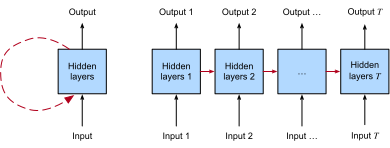

# 再帰ニューラルネットワーク
:label:`chap_rnn`

これまで、私たちは主として固定長データに焦点を当ててきました。
:numref:`chap_regression` と :numref:`chap_classification` で線形回帰とロジスティック回帰を導入し、
:numref:`chap_perceptrons` で多層パーセプトロンを導入したときには、
各特徴ベクトル $\mathbf{x}_i$ が
$x_1, \dots, x_d$ という固定個数の成分から成り、
各数値特徴 $x_j$ が特定の属性に対応していると
仮定してよいことを前提としていました。
このようなデータセットは、しばしば *表形式* データと呼ばれます。
なぜなら、各例 $i$ がそれぞれ1つの行を持ち、
各属性がそれぞれ1つの列を持つ表として
並べることができるからです。
重要なのは、表形式データでは、列の間に
特定の構造をほとんど仮定しないことです。

その後、 :numref:`chap_cnn` では画像データへと進みました。
そこでは入力は画像内の各座標における生の画素値から成ります。
画像データは、典型的な表形式データセットの条件に
ほとんど当てはまりませんでした。
そこで、階層構造と不変性を扱うために
畳み込みニューラルネットワーク（CNN）を用いる必要がありました。
しかし、それでもデータは固定長でした。
Fashion-MNIST の各画像は
$28 \times 28$ の画素値グリッドとして表現されます。
さらに、私たちの目的は1枚の画像だけを見て
単一の予測を出力するモデルを作ることでした。
では、動画のような画像の系列に直面したときや、
画像キャプショニングのように
系列構造を持つ予測を生成する必要があるときには、
どうすればよいのでしょうか。

非常に多くの学習タスクでは、系列データを扱う必要があります。
画像キャプショニング、音声合成、音楽生成はいずれも、
モデルが系列から成る出力を生成することを要求します。
他の分野、たとえば時系列予測、動画解析、音楽情報検索では、
モデルは系列である入力から学習しなければなりません。
こうした要求はしばしば同時に現れます。
たとえば、ある自然言語から別の自然言語へ
文章を翻訳する、対話を行う、あるいはロボットを制御する
といったタスクでは、モデルが系列構造を持つデータを
入力し、かつ出力することが求められます。


再帰ニューラルネットワーク（RNN）は、
*再帰的* な接続によって系列の動態を捉える深層学習モデルです。
これはネットワーク内のノードの循環と考えることができます。
最初は直感に反するように思えるかもしれません。
そもそも、ニューラルネットワークの順伝播的な性質こそが、
計算順序を曖昧でないものにしているからです。
しかし、再帰的な辺は厳密に定義されており、
そのような曖昧さが生じないことが保証されています。
再帰ニューラルネットワークは、時間ステップ（または系列ステップ）にわたって
*展開* され、各ステップで *同じ* 基本パラメータが適用されます。
標準的な接続が、各層の活性を
*同じ時間ステップ内で* 次の層へ伝播するために
*同期的に* 適用されるのに対し、
再帰接続は *動的* であり、
隣接する時間ステップ間で情報を受け渡します。
:numref:`fig_unfolded-rnn` の展開図が示すように、
RNN は、各層のパラメータ（通常の接続と再帰接続の両方）が
時間ステップ間で共有される順伝播ニューラルネットワーク
と考えることができます。



:label:`fig_unfolded-rnn`


ニューラルネットワーク全般と同様に、
RNN には長い学際的な歴史があります。
もともとは脳のモデルとして認知科学者によって広められ、
その後、機械学習コミュニティで実用的なモデリング手法として採用されました。
深層学習全般についてそうするように、
本書では機械学習の視点を採用し、
2010年代に、手書き認識 :cite:`graves2008novel`、
機械翻訳 :cite:`Sutskever.Vinyals.Le.2014`、
医療診断の認識 :cite:`Lipton.Kale.2016` といった多様なタスクでの
画期的な成果によって人気を博した実用的な道具として
RNN に焦点を当てます。
より詳しい背景資料を求める読者には、
公開されている包括的なレビュー :cite:`Lipton.Berkowitz.Elkan.2015` を参照することを勧めます。
また、系列性は RNN に固有のものではないことも指摘しておきます。
たとえば、すでに導入した CNN も、
長さが可変のデータ、たとえば解像度が異なる画像を扱えるように
適応させることができます。
さらに、RNN は近年、Transformer モデルにかなりの市場シェアを譲っており、
それについては :numref:`chap_attention-and-transformers` で扱います。
しかし、RNN は深層学習において複雑な系列構造を扱うための
標準的なモデルとして台頭し、今日に至るまで
系列モデリングの定番モデルであり続けています。
RNN の物語と系列モデリングの物語は
切り離せないほど密接に結びついており、
この章は RNN についての章であると同時に、
系列モデリング問題の ABC についての章でもあります。


ある重要な洞察が、系列モデリングの革命への道を開きました。
機械学習における多くの基本的なタスクでは、
入力と目標を固定長ベクトルとして容易に表現することはできませんが、
それでもしばしば、固定長ベクトルの
長さ可変な系列として表現できます。
たとえば、文書は単語の系列として表現できます。
医療記録はしばしば、出来事の系列
（受診、投薬、処置、検査、診断）として表現できます。
動画は、静止画像の長さ可変な系列として表現できます。


系列モデルは数多くの応用分野に現れていますが、
この分野の基礎研究は主として
自然言語処理の中核タスクにおける進歩によって牽引されてきました。
したがって、この章全体を通して、説明と例は
テキストデータに焦点を当てます。
これらの例の要領をつかめば、
他のデータモダリティへのモデルの適用は
比較的容易なはずです。
次のいくつかの節では、系列に関する基本的な
記法と、系列構造を持つモデル出力の品質を評価するための
いくつかの評価指標を導入します。
その後、言語モデルの基本概念を議論し、
この議論を用いて最初の RNN モデルを動機づけます。
最後に、RNN を通して逆伝播するときの勾配計算方法を説明し、
このようなネットワークの学習時によく遭遇するいくつかの課題を検討して、
:numref:`chap_modern_rnn` で続く現代的な RNN アーキテクチャの動機づけを行います。

```toc
:maxdepth: 2

sequence
text-sequence
language-model
rnn
rnn-scratch
rnn-concise
bptt
```