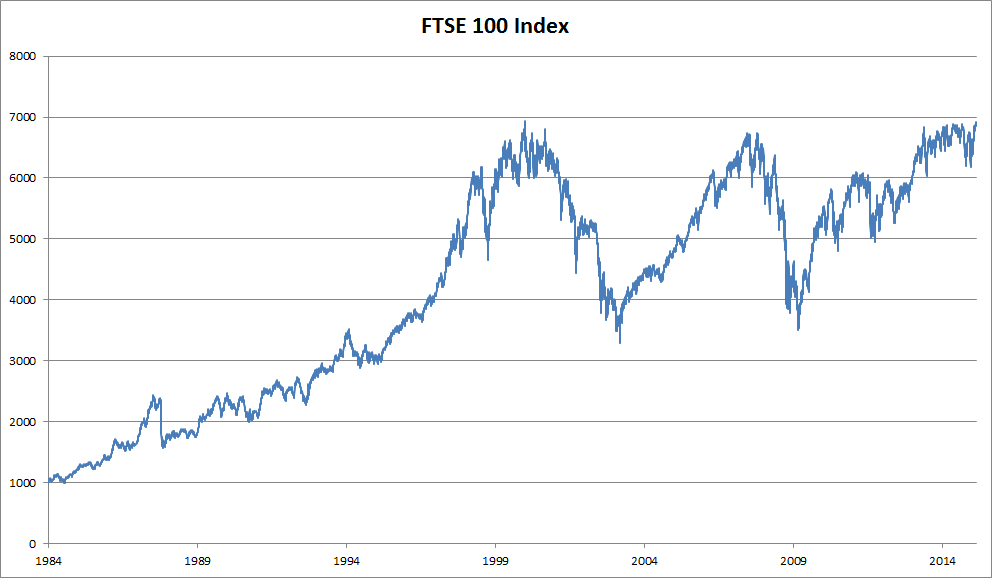

# シーケンスの扱い
:label:`sec_sequence`

これまで、入力が単一の特徴ベクトル $\mathbf{x} \in \mathbb{R}^d$ からなるモデルに焦点を当ててきた。シーケンスを処理できるモデルを開発する際の視点の主な変化は、入力が順序づけられた特徴ベクトルの列 $\mathbf{x}_1, \dots, \mathbf{x}_T$ からなるものに注目するようになることである。ここで各特徴ベクトル $\mathbf{x}_t$ は、$\mathbb{R}^d$ に属する時刻 $t \in \mathbb{Z}^+$ によってインデックス付けされる。

データセットの中には、単一の巨大なシーケンスからなるものもある。たとえば、気候科学者が利用できるかもしれない、極めて長いセンサー観測のストリームを考えてみよう。このような場合、あらかじめ定めた長さの部分シーケンスをランダムにサンプリングすることで、学習用データセットを作成できる。より一般的には、データはシーケンスの集合として与えられる。以下の例を考えてみよう。(i) 文書の集合で、それぞれが単語のシーケンスとして表され、各文書はそれぞれ異なる長さ $T_i$ を持つ。(ii) 入院中の患者の滞在をシーケンスとして表現する場合で、各滞在は複数のイベントからなり、シーケンス長はおおむね滞在期間に依存する。

以前、個々の入力を扱うときには、それらが同じ基礎分布 $P(X)$ から独立にサンプリングされると仮定した。シーケンス全体（たとえば文書全体や患者の軌跡全体）が独立にサンプリングされると仮定することは今でもできるが、各時刻に到着するデータ同士が互いに独立であるとは仮定できない。たとえば、文書の後半に現れそうな単語は、その文書の前半に現れた単語に強く依存する。患者が入院10日目に受ける可能性の高い治療は、直前の9日間に何が起きたかに強く依存する。

これは驚くことではない。もしシーケンスの要素が関連していないと信じるなら、そもそもそれらをシーケンスとしてモデル化しようとはしないはずである。検索ツールや現代的なメールクライアントで人気のある自動補完機能の有用性を考えてみよう。これらが有用なのは、ある初期の接頭辞が与えられたときに、シーケンスのもっともらしい続きが何かを（不完全ではあるが、ランダム推測よりは良く）予測できることが多いからである。多くのシーケンスモデルでは、独立性や定常性すら要求しない。代わりに、シーケンスそのものが、シーケンス全体にわたるある固定された基礎分布からサンプリングされることだけを要求する。

この柔軟な考え方により、たとえば次のような現象を扱える。(i) 文書の冒頭と末尾で見た目が大きく異なること。(ii) 入院期間を通じて患者の状態が回復方向または死亡方向へ変化していくこと。(iii) レコメンダシステムとの継続的なやり取りの中で、顧客の嗜好が予測可能な形で変化していくこと。


固定されたターゲット $y$ を、順序構造を持つ入力から予測したいことがある（たとえば、映画レビューに基づく感情分類）。別のときには、順序構造を持つターゲット ($y_1, \ldots, y_T$) を固定入力から予測したいことがある（たとえば、画像キャプション生成）。さらに別のときには、順序構造を持つ入力に基づいて順序構造を持つターゲットを予測したいこともある（たとえば、機械翻訳や動画キャプション生成）。このようなシーケンス対シーケンスのタスクには2つの形がある。(i) *aligned*：各時刻の入力が対応するターゲットと整列している場合（たとえば、品詞タグ付け）。(ii) *unaligned*：入力とターゲットが必ずしも1対1に対応しない場合（たとえば、機械翻訳）。

あらゆる種類のターゲットを扱うことを考える前に、最も直接的な問題に取り組もう。それは、教師なし密度モデリング（*sequence modeling* とも呼ばれる）である。ここでは、シーケンスの集合が与えられたとき、任意のシーケンスがどれくらい起こりやすいかを与える確率質量関数、すなわち $p(\mathbf{x}_1, \ldots, \mathbf{x}_T)$ を推定することが目標である。

```{.python .input  n=6}
%load_ext d2lbook.tab
tab.interact_select('mxnet', 'pytorch', 'tensorflow', 'jax')
```

```{.python .input  n=7}
%%tab mxnet
%matplotlib inline
from d2l import mxnet as d2l
from mxnet import autograd, np, npx, gluon, init
from mxnet.gluon import nn
npx.set_np()
```

```{.python .input  n=8}
%%tab pytorch
%matplotlib inline
from d2l import torch as d2l
import torch
from torch import nn
```

```{.python .input  n=9}
%%tab tensorflow
%matplotlib inline
from d2l import tensorflow as d2l
import tensorflow as tf
```

```{.python .input  n=9}
%%tab jax
%matplotlib inline
from d2l import jax as d2l
import jax
from jax import numpy as jnp
import numpy as np
```

## 自己回帰モデル


順序構造を持つデータを扱うために設計された特殊なニューラルネットワークを導入する前に、実際のシーケンスデータを見て、基本的な直感と統計的手法をいくつか構築してみよう。特に、FTSE 100 指数の株価データに注目する（:numref:`fig_ftse100`）。各 *時刻* $t \in \mathbb{Z}^+$ において、その時点での指数の価格 $x_t$ を観測する。



:width:`400px`
:label:`fig_ftse100`


ここで、あるトレーダーが短期売買を行いたいとする。つまり、次の時刻に指数が上がると考えるか下がると考えるかに応じて、戦略的に指数に入ったり出たりしたいのである。ほかに特徴量（ニュース、財務報告データなど）がない場合、次の値を予測するために利用できる唯一の信号は、これまでの価格履歴である。したがって、そのトレーダーが知りたいのは、次の時刻に指数が取りうる価格についての確率分布

$$P(x_t \mid x_{t-1}, \ldots, x_1)$$

である。連続値の確率変数に対する分布全体を推定するのは難しいかもしれないが、トレーダーは分布のいくつかの重要な統計量、特に期待値と分散に注目できれば満足だろう。条件付き期待値

を推定する簡単な戦略の1つは、線形回帰モデルを適用することである（:numref:`sec_linear_regression` を参照）。このように、ある信号の値をその信号自身の過去の値に回帰させるモデルは、自然に *自己回帰モデル* と呼ばれる。ただし大きな問題が1つある。入力の数 $x_{t-1}, \ldots, x_1$ は $t$ に応じて変化するのである。言い換えると、入力の数は遭遇するデータ量に応じて増えていく。したがって、履歴データを訓練セットとして扱いたい場合、各例が異なる数の特徴量を持つという問題が残る。この章の以降の多くは、このような *自己回帰* モデリング問題、すなわち関心の対象が $P(x_t \mid x_{t-1}, \ldots, x_1)$ またはこの分布の統計量である場合に、これらの課題を克服するための手法を中心に展開する。

よく繰り返し現れる戦略がいくつかある。まず、長いシーケンス $x_{t-1}, \ldots, x_1$ が利用可能であっても、近い将来を予測するときに、履歴をそんなに遠くまで遡る必要はないかもしれないと考えられる。この場合、長さ $\tau$ の窓に条件付けし、$x_{t-1}, \ldots, x_{t-\tau}$ の観測だけを使うことにする。直ちに得られる利点は、少なくとも $t > \tau$ では、引数の数が常に同じになることである。これにより、固定長ベクトルを入力として必要とする任意の線形モデルや深層ネットワークを訓練できる。第二に、過去の観測の何らかの要約 $h_t$ を保持し（:numref:`fig_sequence-model` を参照）、同時に予測 $\hat{x}_t$ に加えて $h_t$ を更新するモデルを開発することもできる。これにより、$\hat{x}_t = P(x_t \mid h_{t})$ によって $x_t$ を推定するだけでなく、$h_t = g(h_{t-1}, x_{t-1})$ のような更新も行うモデルにつながる。$h_t$ は観測されないため、これらのモデルは *潜在自己回帰モデル* とも呼ばれる。


:label:`fig_sequence-model`

履歴データから訓練データを構成するには、通常、窓をランダムにサンプリングして例を作成する。一般に、時間が止まっているとは考えない。しかし、$x_t$ の具体的な値は変化しても、各観測がそれ以前の観測に基づいて生成されるダイナミクス自体は変化しないと仮定することがよくある。統計学者は、このように変化しないダイナミクスを *定常* と呼ぶ。


## シーケンスモデル

ときには、特に言語を扱う場合、シーケンス全体の同時確率を推定したいことがある。これは、単語のような離散的な *トークン* から構成されるシーケンスを扱うときによくあるタスクである。一般に、このような推定関数は *シーケンスモデル* と呼ばれ、自然言語データに対しては *言語モデル* と呼ばれる。シーケンスモデリングの分野は自然言語処理によって大きく牽引されてきたため、非言語データを扱う場合であっても、シーケンスモデルを「言語モデル」と呼ぶことがよくある。言語モデルはさまざまな理由で有用である。文の尤度を評価したいことがある。たとえば、機械翻訳システムや音声認識システムが生成した2つの候補出力の自然さを比較したいかもしれない。しかし、言語モデリングは尤度を *評価* する能力だけでなく、シーケンスを *サンプリング* する能力、さらには最も尤もらしいシーケンスを最適化する能力も与えてくれる。

言語モデリングは一見すると自己回帰問題のようには見えないかもしれないが、確率の連鎖律を適用して、シーケンス $p(x_1, \ldots, x_T)$ の同時密度を左から右へと条件付き密度の積に分解することで、言語モデリングを自己回帰予測に還元できる。

$$P(x_1, \ldots, x_T) = P(x_1) \prod_{t=2}^T P(x_t \mid x_{t-1}, \ldots, x_1).$$

単語のような離散信号を扱う場合、自己回帰モデルは確率的分類器でなければならず、左側の文脈が与えられたときに次に来る単語について、語彙全体にわたる完全な確率分布を出力する。


### マルコフモデル
:label:`subsec_markov-models`


ここで、上で述べた戦略、すなわちシーケンス全体の履歴 $x_{t-1}, \ldots, x_1$ ではなく、直前の $\tau$ ステップ $x_{t-1}, \ldots, x_{t-\tau}$ のみに条件付ける方法を使いたいとする。予測能力を失うことなく、直前の $\tau$ ステップより前の履歴を捨てられるとき、そのシーケンスは *マルコフ条件* を満たすと言う。つまり、*未来は最近の履歴が与えられたとき過去から条件付き独立である* ということである。$\tau = 1$ のとき、データは *1次マルコフモデル* によって特徴づけられると言い、$\tau = k$ のとき、データは $k^{\textrm{th}}$-order Markov model によって特徴づけられると言う。1次マルコフ条件が成り立つ（$\tau = 1$）場合、同時確率の分解は、各単語が直前の *単語* に条件付けられた確率の積になる。

$$P(x_1, \ldots, x_T) = P(x_1) \prod_{t=2}^T P(x_t \mid x_{t-1}).$$

マルコフ条件が成り立つかのように進むモデルを使うことは、実際にはそれが *近似的に* しか真でないと分かっていても、しばしば有用である。実際のテキスト文書では、左側の文脈をより多く含めるほど情報は増え続ける。しかし、その増加は急速に逓減する。したがって、ときには、$k^{\textrm{th}}$-order Markov condition に依存するモデルを訓練することで、計算上および統計上の困難を回避するという妥協をする。今日の巨大な RNN や Transformer ベースの言語モデルでさえ、数千語を超える文脈を取り込むことはめったにない。


離散データでは、真のマルコフモデルは、各文脈において各単語が何回現れたかを数えるだけで、$P(x_t \mid x_{t-1})$ の相対頻度推定を生成する。データが（言語のように）離散値のみをとる場合、最も尤もらしい単語列は動的計画法を用いて効率的に計算できる。


### デコードの順序

なぜテキストシーケンス $P(x_1, \ldots, x_T)$ の分解を、左から右への条件付き確率の連鎖として表したのか、不思議に思うかもしれない。右から左や、あるいは別の一見ランダムな順序ではだめなのだろうか。原理的には、$P(x_1, \ldots, x_T)$ を逆順に展開しても問題ない。その結果は有効な分解になる。

$$P(x_1, \ldots, x_T) = P(x_T) \prod_{t=T-1}^1 P(x_t \mid x_{t+1}, \ldots, x_T).$$


しかし、言語モデリングのタスクでは、私たちが読む方向と同じ方向でテキストを分解すること（多くの言語では左から右、アラビア語やヘブライ語では右から左）が好まれる理由がいくつもある。第一に、これは単に私たちにとって考えやすい自然な方向だからである。私たちは毎日テキストを読み、その過程は次にどの単語やフレーズが来そうかを予測する能力によって導かれている。誰かの文を何度も最後まで言い切ってしまった経験を思い浮かべてみよう。したがって、このような順方向のデコードを特に好む他の理由がなかったとしても、この順序で予測するときに何が尤もらしいかについて、私たちの直感がより働くというだけでも有用である。

第二に、順序に沿って分解することで、同じ言語モデルを使って任意に長いシーケンスに確率を割り当てられる。ステップ1から $t$ までの確率を $t+1$ 番目の単語まで拡張するには、単に追加トークンの条件付き確率を、以前のトークンに条件付けて掛ければよいのである：$P(x_{t+1}, \ldots, x_1) = P(x_{t}, \ldots, x_1) \cdot P(x_{t+1} \mid x_{t}, \ldots, x_1)$。

第三に、任意の他の位置にある単語よりも、隣接する単語を予測するほうが強力な予測モデルを持てる。すべての分解順序は有効であるが、それらがすべて同じくらい容易な予測モデリング問題を表しているとは限らない。これは言語だけでなく、他の種類のデータにも当てはまる。たとえば、データが因果構造を持つ場合である。たとえば、未来の出来事が過去に影響を与えることはないと考える。したがって、$x_t$ を変えると、その先の $x_{t+1}$ で何が起こるかには影響を与えられるかもしれないが、その逆はできない。つまり、$x_t$ を変えても、過去の出来事の分布は変わらない。ある文脈では、このため $P(x_{t+1} \mid x_t)$ を予測するほうが $P(x_t \mid x_{t+1})$ を予測するより容易になる。たとえば、場合によっては、ある加法ノイズ $\epsilon$ に対して $x_{t+1} = f(x_t) + \epsilon$ と書ける一方で、その逆は成り立たないことがある :cite:`Hoyer.Janzing.Mooij.ea.2009`。これは非常に良い知らせである。というのも、通常、私たちが推定したいのは前向きの方向だからである。:citet:`Peters.Janzing.Scholkopf.2017` の本には、この話題についてさらに詳しい説明がある。ここではその表面をかすめる程度にしか触れない。


## 訓練

テキストデータに注目する前に、まず連続値の合成データで試してみよう。

[**ここでは、1000個の合成データが、時刻に0.01を掛けた値に適用した三角関数の `sin` に従うものとする。問題を少し面白くするために、各サンプルに加法ノイズを加える。**]
このシーケンスから、特徴量とラベルからなる訓練例を抽出する。

```{.python .input  n=10}
%%tab all
class Data(d2l.DataModule):
    def __init__(self, batch_size=16, T=1000, num_train=600, tau=4):
        self.save_hyperparameters()
        self.time = d2l.arange(1, T + 1, dtype=d2l.float32)
        if tab.selected('mxnet', 'pytorch'):
            self.x = d2l.sin(0.01 * self.time) + d2l.randn(T) * 0.2
        if tab.selected('tensorflow'):
            self.x = d2l.sin(0.01 * self.time) + d2l.normal([T]) * 0.2
        if tab.selected('jax'):
            key = d2l.get_key()
            self.x = d2l.sin(0.01 * self.time) + jax.random.normal(key,
                                                                   [T]) * 0.2
```

```{.python .input}
%%tab all
data = Data()
d2l.plot(data.time, data.x, 'time', 'x', xlim=[1, 1000], figsize=(6, 3))
```

まず、データが $\tau^{\textrm{th}}$-order Markov condition を満たすかのように振る舞うモデル、つまり過去 $\tau$ 個の観測だけを使って $x_t$ を予測するモデルを試す。[**したがって、各時刻について、ラベル $y  = x_t$ と特徴量 $\mathbf{x}_t = [x_{t-\tau}, \ldots, x_{t-1}]$ を持つ例が得られる。**]
鋭い読者は、$y_1, \ldots, y_\tau$ に対して十分な履歴がないため、これにより $1000-\tau$ 個の例が得られることに気づいたかもしれない。最初の $\tau$ 個のシーケンスにゼロをパディングすることもできるが、ここでは簡単のためにそれらを捨てる。結果として得られるデータセットには $T - \tau$ 個の例が含まれ、モデルへの各入力のシーケンス長は $\tau$ である。私たちは[**最初の600個の例に対するデータイテレータを作成し**]、sin 関数の1周期分をカバーする。

```{.python .input}
%%tab all
@d2l.add_to_class(Data)
def get_dataloader(self, train):
    features = [self.x[i : self.T-self.tau+i] for i in range(self.tau)]
    self.features = d2l.stack(features, 1)
    self.labels = d2l.reshape(self.x[self.tau:], (-1, 1))
    i = slice(0, self.num_train) if train else slice(self.num_train, None)
    return self.get_tensorloader([self.features, self.labels], train, i)
```

この例では、モデルは標準的な線形回帰になる。

```{.python .input}
%%tab all
model = d2l.LinearRegression(lr=0.01)
trainer = d2l.Trainer(max_epochs=5)
trainer.fit(model, data)
```

## 予測

[**モデルを評価するために、まず1ステップ先予測でどの程度うまくいくかを確認する**]。

```{.python .input}
%%tab pytorch, mxnet, tensorflow
onestep_preds = d2l.numpy(model(data.features))
d2l.plot(data.time[data.tau:], [data.labels, onestep_preds], 'time', 'x',
         legend=['labels', '1-step preds'], figsize=(6, 3))
```

```{.python .input}
%%tab jax
onestep_preds = model.apply({'params': trainer.state.params}, data.features)
d2l.plot(data.time[data.tau:], [data.labels, onestep_preds], 'time', 'x',
         legend=['labels', '1-step preds'], figsize=(6, 3))
```

これらの予測は良さそうに見える。終盤の $t=1000$ 付近でも同様である。

しかし、時刻604（`n_train + tau`）までしかシーケンスデータを観測しておらず、その先を数ステップ予測したいとしたらどうだろうか。残念ながら、時刻609の1ステップ先予測を直接計算することはできない。対応する入力が分からないからである。$x_{604}$ までしか見ていないためである。この問題は、以前の予測をモデルへの入力として次の予測に使い、1ステップずつ先へ進めて、目的の時刻に到達することで解決できる。

$$\begin{aligned}
\hat{x}_{605} &= f(x_{601}, x_{602}, x_{603}, x_{604}), \\
\hat{x}_{606} &= f(x_{602}, x_{603}, x_{604}, \hat{x}_{605}), \\
\hat{x}_{607} &= f(x_{603}, x_{604}, \hat{x}_{605}, \hat{x}_{606}),\\
\hat{x}_{608} &= f(x_{604}, \hat{x}_{605}, \hat{x}_{606}, \hat{x}_{607}),\\
\hat{x}_{609} &= f(\hat{x}_{605}, \hat{x}_{606}, \hat{x}_{607}, \hat{x}_{608}),\\
&\vdots\end{aligned}$$

一般に、観測されたシーケンス $x_1, \ldots, x_t$ に対して、時刻 $t+k$ における予測出力 $\hat{x}_{t+k}$ を $k$*ステップ先予測* と呼ぶ。$x_{604}$ まで観測しているので、その $k$ ステップ先予測は $\hat{x}_{604+k}$ である。言い換えると、多段先予測を行うには、自分自身の予測を使い続けなければならない。これがどの程度うまくいくか見てみよう。

```{.python .input}
%%tab mxnet, pytorch
multistep_preds = d2l.zeros(data.T)
multistep_preds[:] = data.x
for i in range(data.num_train + data.tau, data.T):
    multistep_preds[i] = model(
        d2l.reshape(multistep_preds[i-data.tau : i], (1, -1)))
multistep_preds = d2l.numpy(multistep_preds)
```

```{.python .input}
%%tab tensorflow
multistep_preds = tf.Variable(d2l.zeros(data.T))
multistep_preds[:].assign(data.x)
for i in range(data.num_train + data.tau, data.T):
    multistep_preds[i].assign(d2l.reshape(model(
        d2l.reshape(multistep_preds[i-data.tau : i], (1, -1))), ()))
```

```{.python .input}
%%tab jax
multistep_preds = d2l.zeros(data.T)
multistep_preds = multistep_preds.at[:].set(data.x)
for i in range(data.num_train + data.tau, data.T):
    pred = model.apply({'params': trainer.state.params},
                       d2l.reshape(multistep_preds[i-data.tau : i], (1, -1)))
    multistep_preds = multistep_preds.at[i].set(pred.item())
```

```{.python .input}
%%tab all
d2l.plot([data.time[data.tau:], data.time[data.num_train+data.tau:]],
         [onestep_preds, multistep_preds[data.num_train+data.tau:]], 'time',
         'x', legend=['1-step preds', 'multistep preds'], figsize=(6, 3))
```

残念ながら、この場合は見事に失敗する。予測は数ステップ後にはかなり急速に一定値へと収束してしまう。なぜ、さらに先を予測するときにアルゴリズムの性能はこれほど悪化したのだろうか。結局のところ、誤差が蓄積するからである。ステップ1の後にある誤差 $\epsilon_1 = \bar\epsilon$ があるとしよう。すると、ステップ2の *入力* は $\epsilon_1$ によって摂動されるので、ある定数 $c$ に対して $\epsilon_2 = \bar\epsilon + c \epsilon_1$ 程度の誤差を被る。以下同様である。予測は真の観測値から急速に乖離しうるのである。あなたもこのよくある現象に見覚えがあるかもしれない。たとえば、24時間先までの天気予報はかなり正確な傾向があるが、それを超えると精度は急速に低下する。この章および以降では、これを改善する方法について議論する。

$k = 1, 4, 16, 64$ に対してシーケンス全体で予測を計算し、[**$k$ ステップ先予測の難しさを詳しく見てみよう**]。

```{.python .input}
%%tab pytorch, mxnet, tensorflow
def k_step_pred(k):
    features = []
    for i in range(data.tau):
        features.append(data.x[i : i+data.T-data.tau-k+1])
    # The (i+tau)-th element stores the (i+1)-step-ahead predictions
    for i in range(k):
        preds = model(d2l.stack(features[i : i+data.tau], 1))
        features.append(d2l.reshape(preds, -1))
    return features[data.tau:]
```

```{.python .input}
%%tab jax
def k_step_pred(k):
    features = []
    for i in range(data.tau):
        features.append(data.x[i : i+data.T-data.tau-k+1])
    # The (i+tau)-th element stores the (i+1)-step-ahead predictions
    for i in range(k):
        preds = model.apply({'params': trainer.state.params},
                            d2l.stack(features[i : i+data.tau], 1))
        features.append(d2l.reshape(preds, -1))
    return features[data.tau:]
```

```{.python .input}
%%tab all
steps = (1, 4, 16, 64)
preds = k_step_pred(steps[-1])
d2l.plot(data.time[data.tau+steps[-1]-1:],
         [d2l.numpy(preds[k-1]) for k in steps], 'time', 'x',
         legend=[f'{k}-step preds' for k in steps], figsize=(6, 3))
```

これは、さらに先を予測しようとすると予測品質がどのように変化するかを明確に示している。4ステップ先予測はまだ良さそうに見えるが、それを超えるとほとんど役に立たない。

## 要約

補間と外挿の難しさにはかなりの差がある。したがって、シーケンスがある場合は、訓練時にデータの時間順序を必ず尊重し、つまり未来のデータで訓練してはならない。この種のデータでは、シーケンスモデルの推定には特殊な統計的手法が必要である。よく使われる選択肢は、自己回帰モデルと潜在変数自己回帰モデルである。因果モデル（たとえば時間が前に進む場合）では、前向きの方向を推定するほうが逆方向より通常ずっと容易である。時刻 $t$ までの観測シーケンスに対して、時刻 $t+k$ における予測出力を $k$*ステップ先予測* と呼ぶ。$k$ を増やして時間的にさらに先を予測するほど、誤差は蓄積し、予測品質はしばしば劇的に低下する。

## 演習

1. この節の実験のモデルを改善せよ。
    1. 過去4観測より多くを取り入れるだろうか。 実際にはどれくらい必要だろうか。
    1. ノイズがなければ、過去の観測は何個必要だろうか。 ヒント：$\sin$ と $\cos$ は微分方程式として書ける。
    1. 総特徴量数を一定に保ちながら、より古い観測を取り入れられるだろうか。 それで精度は向上するだろうか。 なぜか。
    1. ニューラルネットワークのアーキテクチャを変えて性能を評価せよ。新しいモデルはより多くのエポックで訓練してもよい。何が観察されるだろうか。
1. 投資家が買うべき有望な証券を見つけたいと考えている。どれがうまくいきそうかを判断するために、過去のリターンを見る。何がこの戦略でうまくいかなくなる可能性があるだろうか。
1. 因果性はテキストにも当てはまるだろうか。どの程度までだろうか。
1. データのダイナミクスを捉えるために、潜在自己回帰モデルが必要になる例を挙げよ。
