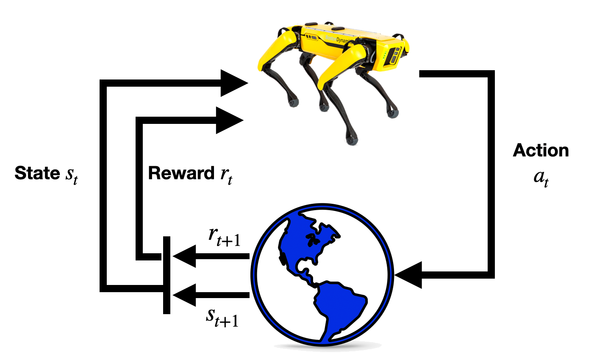

# 強化学習
:label:`chap_reinforcement_learning`


**Pratik Chaudhari** (*University of Pennsylvania and Amazon*), **Rasool Fakoor** (*Amazon*), and **Kavosh Asadi** (*Amazon*)

強化学習（RL）は、意思決定を逐次的に行う機械学習システムを構築するための一連の手法です。たとえば、オンライン小売業者から購入した新しい服が入った荷物は、一連の意思決定の結果として玄関先に届きます。たとえば、小売業者が自宅に最も近い倉庫で服を見つけ、箱に詰め、陸路または空路で箱を輸送し、都市内のあなたの家まで配達する、といった具合です。荷物の配送過程には多くの変数が影響します。たとえば、服が倉庫に在庫としてあったかどうか、箱の輸送にどれだけ時間がかかったか、毎日の配送トラックが出発する前に荷物があなたの街に到着したかどうか、などです。重要なのは、各段階で私たちがあまり制御できないこれらの変数が、将来の出来事の全体の連鎖に影響を与えるという点です。たとえば、倉庫で箱詰めに遅れが生じた場合、小売業者はタイムリーな配送を確実にするために、陸送ではなく空輸で荷物を送る必要があるかもしれません。強化学習の手法を用いると、逐次意思決定問題の各段階で適切な行動を取り、最終的に何らかの効用、たとえば荷物を時間どおりにあなたへ届けること、を最大化できます。

このような逐次意思決定問題は、ほかにも数多く見られます。たとえば、[Go](https://en.wikipedia.org/wiki/Go_(game)) をプレイしているとき、現在の一手が次の一手を決め、相手の手はあなたが制御できない変数です……一連の手が最終的に勝敗を決めます。Netflix が今あなたに推薦する映画は、あなたが次に何を見るかを決めますが、その映画を気に入るかどうかは Netflix には分かりません。最終的には、一連の映画推薦が Netflix に対する満足度を決定します。強化学習は、今日これらの問題に対する効果的な解決策を開発するために使われています :cite:`mnih2013playing,Silver.Huang.Maddison.ea.2016`。強化学習と標準的な深層学習の重要な違いは、標準的な深層学習では、訓練済みモデルがあるテストデータ1件に対して行う予測が、将来の別のテストデータの予測に影響しないのに対し、強化学習では将来の時点での意思決定（RLでは、意思決定は行動とも呼ばれます）が、過去にどのような意思決定が行われたかに影響されることです。

この章では、強化学習の基礎を学び、いくつかの代表的な強化学習手法を実装して実践的な経験を積みます。まず、マルコフ決定過程（MDP）と呼ばれる概念を導入し、このような逐次意思決定問題を考えるための枠組みを作ります。Value Iteration と呼ばれるアルゴリズムは、MDP における制御されない変数（RL では、これらの制御される変数は環境と呼ばれます）が通常どのように振る舞うかを知っているという仮定のもとで、強化学習問題を解くための最初の手がかりとなります。Value Iteration のより一般的な形である Q-Learning を用いると、環境について必ずしも完全な知識がなくても適切な行動を取ることができます。次に、専門家の行動を模倣することで、深層ネットワークを強化学習問題にどう用いるかを学びます。最後に、未知の環境で行動を選択するために深層ネットワークを用いる強化学習手法を構築します。これらの手法は、今日さまざまな実世界の応用で使われている、より高度な RL アルゴリズムの基盤を成しており、そのいくつかについては本章で触れます。


:width:`400px`
:label:`fig_rl_big`

```toc
:maxdepth: 2

mdp
value-iter
qlearning
```