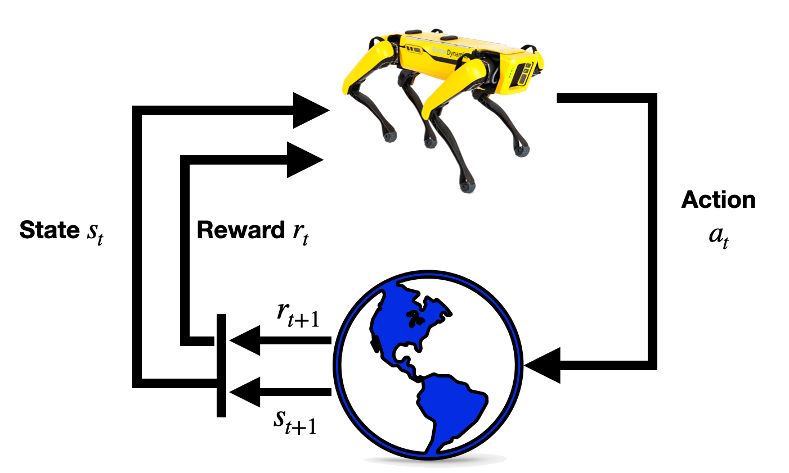

# 強化学習（Reinforcement Learning）とは：基礎理論と実装
:label:`chap_reinforcement_learning`

**強化学習（Reinforcement Learning）とは**、エージェントが環境との相互作用を通じて、報酬を最大化するよう行動を試行錯誤しながら学習する機械学習の一分野であり、MDP（マルコフ決定過程）などの数学的枠組みに基づく。

**Pratik Chaudhari** (*University of Pennsylvania and Amazon*), **Rasool Fakoor** (*Amazon*), and **Kavosh Asadi** (*Amazon*)

強化学習（RL）は、逐次的な意思決定を行う機械学習システムを構築するための一連の手法である。たとえば、オンライン小売業者から購入した新しい服の荷物が玄関先に届くまでには、一連の意思決定が関わっている。小売業者は自宅に最も近い倉庫で服を見つけ、箱に詰め、陸路または空路で輸送し、最終的に都市内の自宅まで配達する。この配送過程には多くの変数が影響する。たとえば、服が倉庫に在庫として存在したか、輸送にどれだけ時間がかかったか、毎日の配送トラックが出発する前に荷物が街に到着したか、などである。重要なのは、各段階でほとんど制御できないこれらの変数が、その後に続く出来事の連鎖全体に影響を及ぼす点である。たとえば、倉庫で箱詰めが遅れた場合、小売業者は予定どおりの配送を実現するために、陸送ではなく空輸を選ぶ必要があるかもしれない。強化学習の手法を用いれば、逐次意思決定問題の各段階で適切な行動を選び、最終的に何らかの効用、たとえば荷物を時間どおりに届けること、を最大化できる。

このような逐次意思決定問題は、ほかにも数多く存在する。たとえば、[Go](https://en.wikipedia.org/wiki/Go_(game)) をプレイするとき、現在の一手が次の一手に影響し、相手の手は制御できない変数である。そして、一連の手が最終的に勝敗を決める。Netflix が今推薦する映画は次に何を見るかに影響するが、その映画を気に入るかどうかは Netflix には分からない。最終的には、一連の映画推薦が Netflix に対する満足度を左右する。強化学習は、今日これらの問題に対する有効な解決策を開発するために用いられている :cite:`mnih2013playing,Silver.Huang.Maddison.ea.2016`。強化学習と標準的な深層学習の重要な違いは、標準的な深層学習では、訓練済みモデルがあるテストデータ1件に対して行う予測が、将来の別のテストデータに対する予測へ影響しないのに対し、強化学習では将来の時点での意思決定（RL では行動とも呼ぶ）が、過去にどのような意思決定を行ったかに依存する点である。

この章では、強化学習の基礎を学び、いくつかの代表的な強化学習手法を実装して実践的な経験を積む。まず、マルコフ決定過程（MDP）という概念を導入し、この種の逐次意思決定問題を考えるための枠組みを与える。Value Iteration と呼ばれるアルゴリズムは、MDP における制御できない変数（RL では、これらの制御できない変数を環境と呼ぶ）が通常どのように振る舞うかを知っているという仮定のもとで、強化学習問題を解くための最初の手がかりとなる。Value Iteration を一般化した Q-Learning を用いると、環境について完全な知識がなくても適切な行動を選べる。次に、専門家の行動を模倣することで、深層ネットワークを強化学習問題にどのように用いるかを学ぶ。最後に、未知の環境で行動を選択するために深層ネットワークを用いる強化学習手法を構築する。これらの手法は、今日さまざまな実世界の応用で使われている、より高度な RL アルゴリズムの基盤を成しており、その一部について本章で触れる。


:width:`400px`
:label:`fig_rl_big`

```toc
:maxdepth: 2

mdp
value-iter
qlearning
```