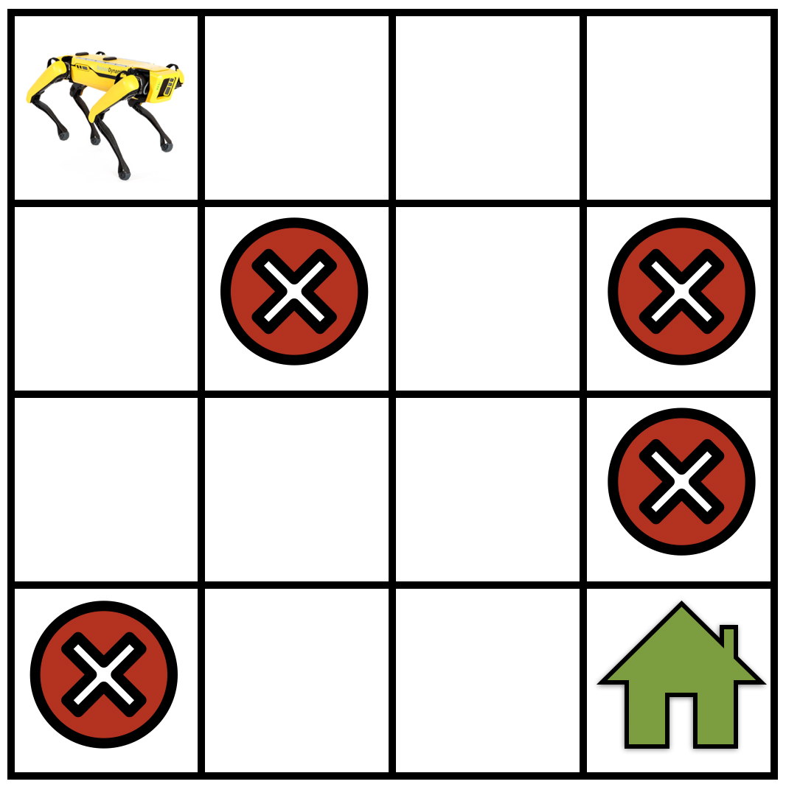

# マルコフ決定過程（MDP）
:label:`sec_mdp`
この節では、マルコフ決定過程（MDP）を用いて強化学習問題をどのように定式化するかを議論し、MDPのさまざまな構成要素を詳しく説明します。 

## MDPの定義

マルコフ決定過程（MDP） :cite:`BellmanMDP` は、システムにさまざまな行動が適用されたときに、そのシステムの状態がどのように変化するかを表すモデルです。MDPは、いくつかの異なる量が組み合わさって構成されます。

:width:`250px`
:label:`fig_mdp`

* $\mathcal{S}$ をMDPにおける状態の集合とします。具体例として、グリッドワールドを移動するロボットについて :numref:`fig_mdp` を見てください。この場合、$\mathcal{S}$ は、ロボットが任意の時刻に存在しうる位置の集合に対応します。
* $\mathcal{A}$ を、ロボットが各状態で取りうる行動の集合とします。たとえば、「前進する」「右に曲がる」「左に曲がる」「同じ場所にとどまる」などです。行動によって、ロボットの現在の状態は $\mathcal{S}$ の中の別の状態へ変化しえます。
* ロボットがどのように動くのかを*正確には*知らず、ある近似までしか分からないことがあります。強化学習では、この状況を次のようにモデル化します。ロボットが「前進する」という行動を取ったとき、現在の状態にとどまる小さな確率や、「左に曲がる」小さな確率などがあるかもしれません。数学的には、これは「遷移関数」$T: \mathcal{S} \times \mathcal{A} \times \mathcal{S} \to [0,1]$ を定義することに相当し、ロボットが状態 $s$ にいて行動 $a$ を取ったときに状態 $s'$ に到達する条件付き確率を用いて $T(s, a, s') = P(s' \mid s, a)$ と表します。遷移関数は確率分布であるため、すべての $s \in \mathcal{S}$ と $a \in \mathcal{A}$ について $\sum_{s' \in \mathcal{S}} T(s, a, s') = 1$ が成り立ちます。すなわち、ロボットは行動を取れば必ず何らかの状態へ移動しなければなりません。
* 次に、「どの行動が有用で、どの行動が有用でないか」という概念を、「報酬」$r: \mathcal{S} \times \mathcal{A} \to \mathbb{R}$ を用いて定義します。ロボットが状態 $s$ で行動 $a$ を取ったとき、報酬 $r(s,a)$ を得るとします。報酬 $r(s, a)$ が大きいなら、それは状態 $s$ で行動 $a$ を取ることが、ロボットの目標、すなわち緑の家に到達することにより有用であることを示します。報酬 $r(s, a)$ が小さいなら、その行動 $a$ はこの目標達成にあまり有用ではありません。重要なのは、報酬は目標を念頭に置いて、ユーザ（強化学習アルゴリズムを作成する人）によって設計されるという点です。

## リターンと割引率

上のさまざまな構成要素を合わせると、マルコフ決定過程（MDP）
$$\textrm{MDP}: (\mathcal{S}, \mathcal{A}, T, r).$$
となります。

では、ロボットが特定の状態 $s_0 \in \mathcal{S}$ から始まり、行動を取り続けて次のような軌道を生じる状況を考えましょう。
$$\tau = (s_0, a_0, r_0, s_1, a_1, r_1, s_2, a_2, r_2, \ldots).$$

各時刻 $t$ において、ロボットは状態 $s_t$ にあり、行動 $a_t$ を取り、その結果として報酬 $r_t = r(s_t, a_t)$ を得ます。軌道の*リターン*とは、そのような軌道に沿ってロボットが得る総報酬のことです。
$$R(\tau) = r_0 + r_1 + r_2 + \cdots.$$

強化学習の目標は、*リターン*が最大となる軌道を見つけることです。

ロボットが目標地点に到達することなく、グリッドワールド内を移動し続ける状況を考えてみてください。この場合、軌道における状態と行動の列は無限に長くなりえ、そのような無限長の軌道の*リターン*は無限大になります。このような軌道に対しても強化学習の定式化を意味のあるものに保つために、割引率 $\gamma < 1$ という概念を導入します。割引された*リターン*は次のように書きます。
$$R(\tau) = r_0 + \gamma r_1 + \gamma^2 r_2 + \cdots = \sum_{t=0}^\infty \gamma^t r_t.$$

$\gamma$ が非常に小さい場合、たとえば $t = 1000$ のような遠い将来にロボットが得る報酬は、$\gamma^{1000}$ という係数によって大きく割り引かれます。これにより、ロボットは目標を達成する短い軌道、すなわちグリッドワールドの例で緑の家へ向かうこと（:numref:`fig_mdp` を参照）を選びやすくなります。割引率が大きい場合、たとえば $\gamma = 0.99$ では、ロボットは*探索*を行い、その後で目標地点へ向かう最良の軌道を見つけるよう促されます。

## マルコフ仮定についての考察

新しいロボットを考えてみましょう。ここでは、状態 $s_t$ は上と同じく位置ですが、行動 $a_t$ は「前進する」のような抽象的な命令ではなく、ロボットが車輪に加える加速度です。このロボットが状態 $s_t$ で非ゼロの速度を持っているなら、次の位置 $s_{t+1}$ は、過去の位置 $s_t$、加速度 $a_t$、さらに時刻 $t$ におけるロボットの速度の関数になります。速度は $s_t - s_{t-1}$ に比例します。これは、次のように書けることを示しています。

$$s_{t+1} = \textrm{some function}(s_t, a_t, s_{t-1});$$

この場合の「some function」はニュートンの運動法則に相当します。これは、単に $s_t$ と $a_t$ に依存する遷移関数とはかなり異なります。

マルコフ系とは、次の状態 $s_{t+1}$ が現在の状態 $s_t$ と、現在の状態で取られた行動 $a_t$ のみに依存するようなシステムのことです。マルコフ系では、次の状態は過去にどの行動が取られたか、あるいは過去にロボットがどの状態にいたかには依存しません。たとえば、上で行動が加速度である新しいロボットは、次の位置 $s_{t+1}$ が速度を通じて前の状態 $s_{t-1}$ に依存するため、マルコフ的ではありません。システムがマルコフ的であるという性質は制約が強い仮定に見えるかもしれませんが、実際にはそうではありません。マルコフ決定過程は、依然として非常に広いクラスの実システムをモデル化できます。たとえば、この新しいロボットについて、状態 $s_t$ を $(\textrm{location}, \textrm{velocity})$ の組に選べば、次の状態 $(\textrm{location}_{t+1}, \textrm{velocity}_{t+1})$ は現在の状態 $(\textrm{location}_t, \textrm{velocity}_t)$ と現在の状態での行動 $a_t$ のみに依存するので、システムはマルコフ的になります。

## まとめ
強化学習問題は通常、マルコフ決定過程を用いてモデル化されます。マルコフ決定過程（MDP）は、4つの要素 $(\mathcal{S}, \mathcal{A}, T, r)$ の組で定義されます。ここで $\mathcal{S}$ は状態空間、$\mathcal{A}$ は行動空間、$T$ はMDPの遷移確率を表す遷移関数、そして $r$ は特定の状態で行動を取ることによって得られる即時報酬です。

## 演習

1. [MountainCar](https://www.gymlibrary.dev/environments/classic_control/mountain_car/) 問題をモデル化するMDPを設計したいとします。
    1. 状態の集合は何になるでしょうか？
    2. 行動の集合は何になるでしょうか？
    3. 取りうる報酬関数は何でしょうか？
2. [Pong game](https://www.gymlibrary.dev/environments/atari/pong/) のような Atari ゲームのために、どのようにMDPを設計しますか？
