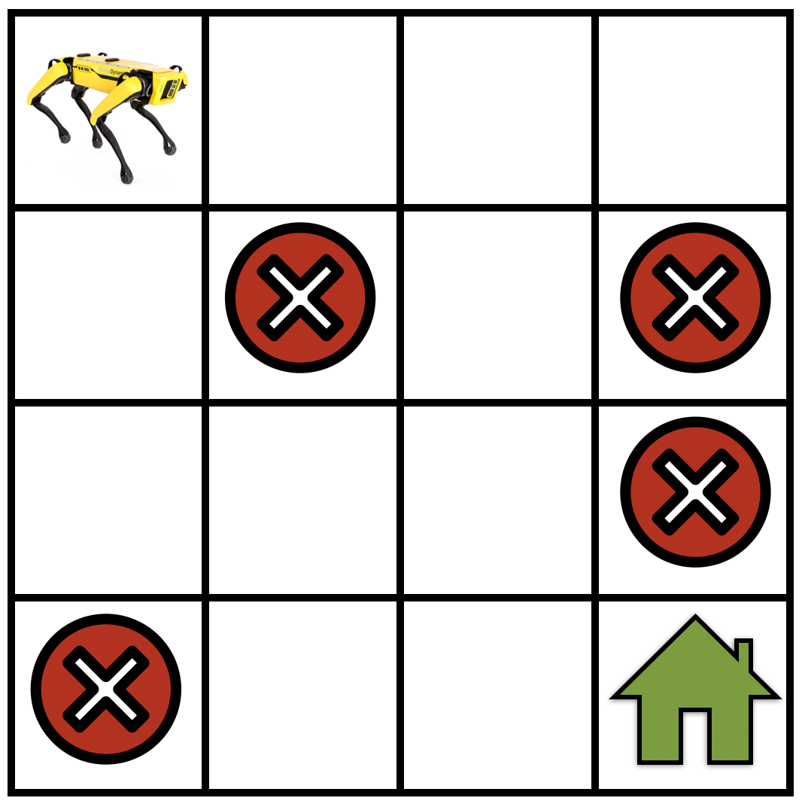

# マルコフ決定過程（MDP）
:label:`sec_mdp`

この節では、強化学習の問題をマルコフ決定過程（MDP）でどのように定式化するかを述べ、その各構成要素を詳しく説明する。

## MDPの定義

マルコフ決定過程（MDP） :cite:`BellmanMDP` は、システムにさまざまな行動を適用したときに状態がどのように変化するかを記述するモデルである。MDPは、いくつかの要素の組として定義される。

:width:`250px`
:label:`fig_mdp`

* $\mathcal{S}$ をMDPの状態集合とする。具体例として、グリッドワールド内を移動するロボットを :numref:`fig_mdp` に示す。このとき $\mathcal{S}$ は、ロボットが各時刻に取りうる位置の集合に対応する。
* $\mathcal{A}$ を、ロボットが各状態で選択できる行動の集合とする。たとえば、「前進する」「右に曲がる」「左に曲がる」「その場にとどまる」などである。行動に応じて、ロボットの状態は $\mathcal{S}$ 内の別の状態へ遷移する。
* ロボットの運動を*完全には*把握できず、近似的にしか分からないことがある。強化学習では、そのような状況を次のように表す。ロボットが「前進する」という行動を選んでも、小さな確率でその場にとどまったり、小さな確率で「左に曲がる」結果になったりするかもしれない。数学的には、これは「遷移関数」$T: \mathcal{S} \times \mathcal{A} \times \mathcal{S} \to [0,1]$ を導入し、ロボットが状態 $s$ にいて行動 $a$ を取ったときに次状態 $s'$ へ遷移する条件付き確率を
  $T(s, a, s') = P(s' \mid s, a)$
  と表すことに対応する。遷移関数は確率分布であるから、すべての $s \in \mathcal{S}$ と $a \in \mathcal{A}$ に対して $\sum_{s' \in \mathcal{S}} T(s, a, s') = 1$ が成り立つ。すなわち、行動を取れば必ず何らかの状態に遷移する。
* 次に、「どの行動が望ましく、どの行動が望ましくないか」を、「報酬」$r: \mathcal{S} \times \mathcal{A} \to \mathbb{R}$ によって定める。ロボットが状態 $s$ で行動 $a$ を取ると、報酬 $r(s,a)$ を受け取るとする。$r(s, a)$ が大きいほど、状態 $s$ で行動 $a$ を取ることがロボットの目標、すなわち緑の家に到達することにとって有利であることを意味する。逆に $r(s, a)$ が小さければ、その行動 $a$ は目標達成にあまり寄与しない。重要なのは、報酬は目標に応じてユーザ、すなわち強化学習アルゴリズムの設計者が与えるという点である。

## リターンと割引率

以上の要素をまとめると、マルコフ決定過程（MDP）は
$$\textrm{MDP}: (\mathcal{S}, \mathcal{A}, T, r).$$
と書ける。

次に、ロボットがある初期状態 $s_0 \in \mathcal{S}$ から出発し、行動を繰り返し選択して、次のような軌道を生成する状況を考える。
$$\tau = (s_0, a_0, r_0, s_1, a_1, r_1, s_2, a_2, r_2, \ldots).$$

各時刻 $t$ において、ロボットは状態 $s_t$ にあり、行動 $a_t$ を取り、その結果として報酬 $r_t = r(s_t, a_t)$ を得る。軌道の*リターン*とは、その軌道に沿って得られる報酬の総和である。
$$R(\tau) = r_0 + r_1 + r_2 + \cdots.$$

強化学習の目標は、*リターン*を最大化する軌道を見つけることである。

ここで、ロボットが目標地点に到達せず、グリッドワールド内を動き続ける場合を考えよう。このとき、軌道に含まれる状態と行動の列は無限に続きうるため、そのままでは*リターン*が無限大になる可能性がある。このような無限長の軌道に対しても問題設定を意味のあるものに保つため、割引率 $\gamma < 1$ を導入する。割引リターンは次のように定義する。
$$R(\tau) = r_0 + \gamma r_1 + \gamma^2 r_2 + \cdots = \sum_{t=0}^\infty \gamma^t r_t.$$

$\gamma$ が非常に小さいと、たとえば $t = 1000$ のような遠い将来に得られる報酬は、$\gamma^{1000}$ によって大きく減衰する。その結果、ロボットは目標に早く到達する短い軌道、すなわちグリッドワールドの例では緑の家へ向かう軌道（:numref:`fig_mdp` を参照）を選びやすくなる。一方、割引率が大きい場合、たとえば $\gamma = 0.99$ では、ロボットはより広く*探索*し、その後で目標地点へ向かうより良い軌道を見つけやすくなる。

## マルコフ仮定についての考察

別のロボットを考えよう。ここでは、状態 $s_t$ は先ほどと同様に位置であるが、行動 $a_t$ は「前進する」のような抽象的な命令ではなく、ロボットが車輪に加える加速度である。このロボットが時刻 $t$ に非ゼロの速度をもつなら、次の位置 $s_{t+1}$ は、現在位置 $s_t$、加速度 $a_t$、さらに時刻 $t$ における速度に依存する。速度は $s_t - s_{t-1}$ に比例するため、これは次のように書ける。

$$s_{t+1} = \textrm{some function}(s_t, a_t, s_{t-1});$$

ここでの「some function」は、ニュートンの運動法則に対応する。この形は、単に $s_t$ と $a_t$ のみに依存する遷移関数とは大きく異なる。

マルコフ系とは、次状態 $s_{t+1}$ が現在の状態 $s_t$ と、その状態で選んだ行動 $a_t$ のみに依存するシステムである。マルコフ系では、次状態は過去にどの行動を取ったか、あるいは過去にどの状態にいたかには依存しない。たとえば、上の新しいロボットでは、次の位置 $s_{t+1}$ が速度を介して前の状態 $s_{t-1}$ に依存するため、そのままではマルコフ的ではない。システムがマルコフ的であるという仮定は一見すると強い制約に思えるかもしれないが、実際にはそうではない。MDPは依然として非常に広い範囲の実システムを表現できる。たとえば、このロボットの状態 $s_t$ を $(\textrm{location}, \textrm{velocity})$ の組として定義すれば、次状態 $(\textrm{location}_{t+1}, \textrm{velocity}_{t+1})$ は現在の状態 $(\textrm{location}_t, \textrm{velocity}_t)$ と現在の行動 $a_t$ のみに依存する。したがって、このように状態を拡張すればシステムはマルコフ的になる。

## まとめ

強化学習の問題は通常、マルコフ決定過程によってモデル化する。マルコフ決定過程（MDP）は、4つ組 $(\mathcal{S}, \mathcal{A}, T, r)$ として定義される。ここで、$\mathcal{S}$ は状態空間、$\mathcal{A}$ は行動空間、$T$ は遷移確率を与える遷移関数、$r$ は特定の状態で行動を取ったときに得られる即時報酬である。

## 演習

1. [MountainCar](https://www.gymlibrary.dev/environments/classic_control/mountain_car/) 問題を表すMDPを設計したいとする。
    1. 状態集合は何になるだろうか。
    2. 行動集合は何になるだろうか。
    3. どのような報酬関数が考えられるだろうか。
2. [Pong game](https://www.gymlibrary.dev/environments/atari/pong/) のような Atari ゲームに対して、どのようにMDPを設計するだろうか。